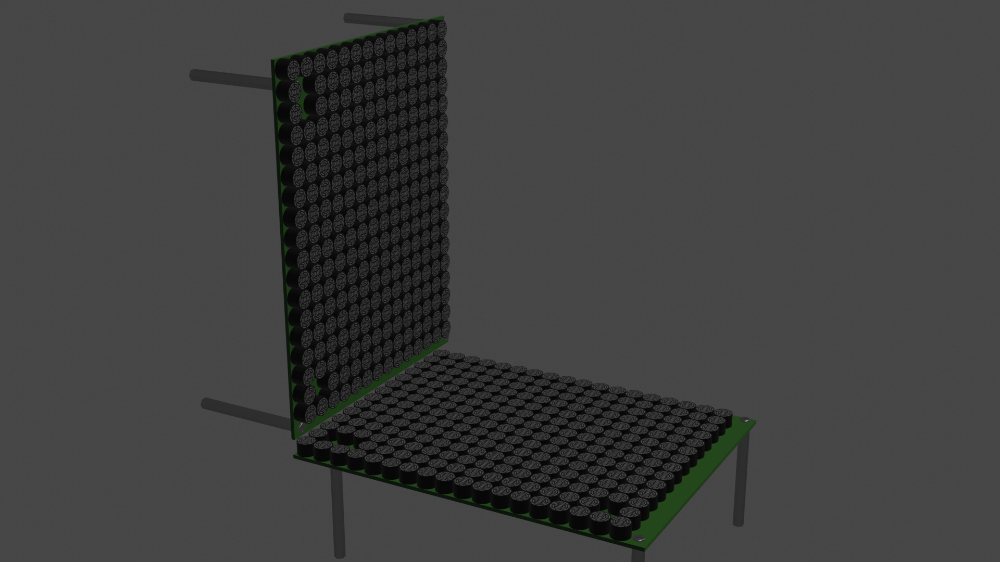

# Geometry

この章ではGeometryについて解説する.
GeometryはAUTD3デバイスが現実世界でどのように配置されているかを管理している.

## Multiple devices

AUTD3のデバイスは複数台をデイジーチェーンで接続できるようになっている.
SDKは複数台を接続したとしても, 透過的に使用できるように設計されている.

複数のデバイスを接続する場合は,
PCと1台目のEtherCAT Inをケーブルでつなぎ, $i$台目のEtherCAT Outと$i+1$台目のEtherCAT Inをケーブルで接続する ([Concept](concept.md)参照).
なお, 電源もデイジーチェーンで接続でき, 電源コネクタは3つの内で好きなところを使って良い.

SDKで複数台のデバイスを使用する場合は`add_device`関数を接続しているデバイスの分だけ呼び出せば良い.
`add_device`関数の第1引数は位置であり, 第2引数は回転を表す.
回転はZYZのオイラー角, または, Quaternionで指定する.
移動は指定した回転を施した後に, グローバル座標で並進移動となっているので注意されたい.

<figure>
  
  <figcaption>Horizontal alignment</figcaption>
</figure>

例えば, 上図のように配置・接続しており, 図左側のデバイスが1台目, 右側のデバイスが2台目だとする.
さらに, グローバル座標を1台目のローカル座標と同じだとすると,
```cpp
  autd.geometry().add_device(aud3::Vector3::Zero(), aud3::Vector3::Zero());
  autd.geometry().add_device(aud3::Vector3(aud3::DEVICE_WIDTH, 0, 0), aud3::Vector3::Zero());
```
とすれば良い.
ここで, `DEVICE_WIDTH`はデバイスの (基板外形を含めた) 横幅である.
回転はしないので, 第2引数はゼロで良い.

また, 例えば, グローバル座標を2台目のローカル座標と同じだとすると,
```cpp
  autd.geometry().add_device(aud3::Vector3(-aud3::DEVICE_WIDTH, 0, 0), aud3::Vector3::Zero());
  autd.geometry().add_device(aud3::Vector3::Zero(), aud3::Vector3::Zero());
```
とすれば良い.

<figure>
  
  <figcaption>Vertical alignment</figcaption>
</figure>

さらに, 例えば, 上図のように配置されており, 下が1台目, 左が2台目で, グローバル座標を1台目のローカル座標と同じだとすると,
```cpp
  autd.geometry().add_device(aud3::Vector3::Zero(), aud3::Vector3::Zero());
  autd.geometry().add_device(aud3::Vector3(0, 0, aud3::DEVICE_WIDTH), aud3::Vector3(0, autd3::pi / 2.0, 0));
```
のように指定する.

SDKにおけるAPIでは, すべてグローバル座標を用いるため, 接続するデバイスの数に依存せず透過的に使用できる.

## Geometry viewer

`GeometryViewer`を使用すると, `Geometry`の位置関係が確認できる.

```cpp

#include "autd3/extra/geometry_viewer.hpp"

...

  autd3::extra::GeometryViewer().window_size(800, 600).vsync(true).view(autd.geometry());
```

`GeometryViewer`を使用するにはCMakeで`BUILD_GEOMETRY_VIEWER`オプションをOnにする必要がある[^vulkan_mac].

[^vulkan_mac]: macで使用する場合は, [Vulkan SDK](https://www.lunarg.com/vulkan-sdk/)をインストールする必要がある.
