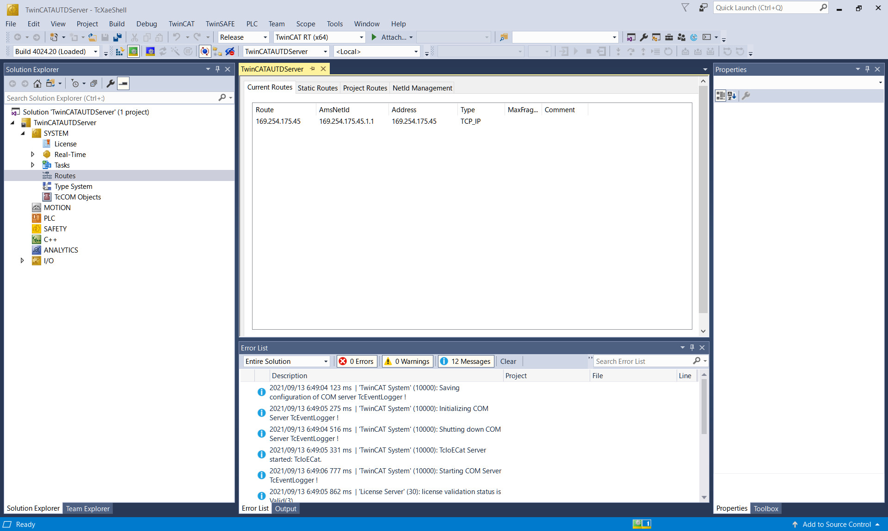

# Link

LinkはAUTD3デバイスとのインターフェースである.
以下の中から一つを選択する必要がある.

[[_TOC_]]

## TwinCAT

TwinCATはPCでEherCATを使用する際の唯一の公式の方法である.
TwinCATはWindowsのみをサポートする非常に特殊なソフトウェアであり, Windowsを半ば強引にリアルタイム化する.

また, 特定のネットワークコントローラが求められるため,
[対応するネットワークコントローラの一覧](https://infosys.beckhoff.com/english.php?content=../content/1033/tc3_overview/9309844363.html&id=)を確認すること.

> Note: 或いは, TwinCATのインストール後に, `C:/TwinCAT/3.1/Driver/System/TcI8254x.inf`に対応するデバイスのVendor IDとDevice IDが書かれているので,「デバイスマネージャー」→「イーサネットアダプタ」→「プロパティ」→「詳細」→「ハードウェアID」と照らし合わせることでも確認できる.

上記以外のネットワークコントローラでも動作する場合があるが, その場合, 正常な動作とリアルタイム性は保証されない.

TwinCAT linkを使用するには`BUILD_LINK_TWINCAT`フラグをONにしてビルドするか, 或いは, 配布している`link_twincat`ライブラリをリンクされたい.

### TwinCATのインストール

前提として, TwinCATはHyper-VやVirtual Machine Platformと共存できない.
そのため, これらの機能を無効にする必要がある.
これには, 例えば, PowerShellを管理者権限で起動し,

```
Disable-WindowsOptionalFeature -Online -FeatureName Microsoft-Hyper-V-Hypervisor
Disable-WindowsOptionalFeature -Online -FeatureName VirtualMachinePlatform
```

と打ち込めば良い.

まず, TwinCAT XAEを[公式サイト](https://www.beckhoff.com/en-en/)からダウンロードする.
ダウンロードには登録 (無料) が必要になる.

ダウンロードしたインストーラを起動し, 指示に従う.
**この時, TwinCAT XAE Shell installにチェックを入れ, Visual Studio Integrationのチェックを外すこと.**

インストール後に再起動し, `C:/TwinCAT/3.1/System/win8settick.bat`を管理者権限で実行し, 再び再起動する.

最後に, SDK内の`dist/TwinCATAUTDServer/AUTD.xml`を`C:/TwinCAT/3.1/Config/Io/EtherCAT`にコピーする.

### TwinCATAUTDServer

TwinCATのLinkを使うには, まず, `dist/TwinCATAUTDServer/TwinCATAUTDServer.exe`を実行する.

初回のみ, ドライバをインストールするために, `-k`オプションを付けて, TwinCAT XAE Shellを開いたままにしておくこと.

```
TwinCATAUTDServer.exe -k
```

> Note: もし閉じてしまった場合は, `%TEMP%/TwinCATAUTDServer/TwinCATAUTDServer.sln`をTcXaeShell Applicationとして開けば良い. `%TEMP%`は環境変数で, 普通は`C:/Users/(user name)/AppData/Local/Temp`である.

なお, TwinCATAUTDServerはPCの電源を切る, スリープモードに入る等でLinkが途切れるので, その都度実行し直すこと.

#### ドライバのインストール

初回はEherCAT用のドライバのインストールが必要になる.
TwinCAT XAE Shell上部メニューから「TwinCAT」→「Show Realtime Ethernet Compatible Devices」を開き「Compatible devices」の中の対応デバイスを選択し, Installをクリックする.
「Installed and ready to use devices (realtime capable)」にインストールされたアダプタが表示されていれば成功である.

なお,「Compatible devices」に何も表示されていない場合はそのPCのイーサネットデバイスはTwinCATに対応していない.
「Incompatible devices」の中のドライバもインストール自体は可能で, インストールすると「Installed and ready to use devices (for demo use only)」と表示される.
この場合, 使用できるが動作保証はない.

#### ライセンス

また, 初回はライセンス関係のエラーが出るので, XAE Shellで「Solution Explorer」→「SYSTEM」→「License」を開き, 「7 Days Trial License ...」をクリックし, 画面に表示される文字を入力する.
なお. ライセンスは7日間限定のトライアルライセンスだが, 切れたら再び同じ作業を行うことで再発行できる.
ライセンスを発行し終わったら, TwinCAT XAE Shellを閉じて, 再び`TwinCATAUTDServer.exe`を実行する.

### トラブルシューティング

大量のデバイスを使用しようとすると, 下の図のようなエラーが発生することがある.

<figure>
  
  <figcaption>9台のAUTD3デバイスを使用した際のTwinCATエラー</figcaption>
</figure>

この場合は, `TwinCATAUTDServer`のオプションの`-s`と`-t`の値を増やし, TwinCATAUTDServerを再び実行する.
これらのオプションの値はデフォルトでそれぞれ`2`になっている.

```
TwinCATAUTDServer.exe -s 3 -t 3
```

どの程度の値にすればいいかは接続する台数による.
エラーが出ない中で可能な限り小さな値が望ましい.
例えば, 9台の場合は3, 4程度の値にしておけば動作するはずである.

## RemoteTwinCAT

前述の通り, AUTD3とTwinCATを使う場合はWindows OSと特定のネットワークアダプタが必要になる.
Windows以外のPCで開発したい場合は, RemoteTwinCAT linkを用いてLinux/macOSから遠隔でTwinCATを操作することができる.
(後述のSOEMもLinux/macOSで動作する.)

RemoteTwinCAT linkを使用するには`BUILD_LINK_REMOTE_TWINCAT`フラグをONにしてビルドするか, 或いは, 配布している`link_remote_twincat`ライブラリをリンクされたい.

### セットアップ

RemoteTwinCATを使用する場合はPCを2台用意する必要がある.
この時, 片方のPCは上記のTwinCAT linkが使えるである必要がある.
このPCをここでは"サーバ"と呼ぶ.
一方, 開発側のPC, 即ちSDKを使用する側は特に制約はなく, サーバと同じLANに繋がっていれば良い, こちらをここでは"クライアント"と呼ぶ.

<figure>
  
  <figcaption>Network Configuration</figcaption>
</figure>

まず, サーバとAUTDデバイスを接続する.
この時使うLANのアダプタはTwinCAT linkと同じく, TwinCAT対応のアダプタである必要がある.
また, サーバとクライアントを別のLANで繋ぐ.
こちらのLANアダプタはTwinCAT対応である必要はない[^fn_remote_twin].
そして, サーバとクライアント間のLANのIPを確認しておく.
ここでは例えば, サーバ側が"169.254.205.219", クライアント側が"169.254.175.45"だったとする.
次に, サーバでTwinCATAUTDServerを起動する.
この時, `-c`オプションでクライアントのIPアドレス (この例だと`169.254.175.45`) を指定する.
また, 最後に`-k`オプションを使用し, TwinCATAUTDServerを開いたままにしておく.

```
TwinCATAUTDServer.exe -c 169.254.175.45 -k
```

そして, 以下の図のように, System→Routesを開き, NetId ManagementタブのLocal NetIdを確認しておく.

<figure>
  
  <figcaption>Server AmsNetId</figcaption>
</figure>

ここでは, "172.16.99.194.1.1"だったとする.
この時, クライアント側は`autd3/link/remote_twincat.hpp`ヘッダーをincludeして,
```cpp
#include "autd3/link/remote_twincat.hpp"

...

  const std::string server_ams_net_id = "172.16.99.194.1.1";
  auto link = autd3::link::RemoteTwinCAT(server_ams_net_id).build();
```
のようにすれば良い.

場合によっては, クライアント側でサーバのIPアドレスとクライアントのAMS NetIdを指定する必要があるかもしれない.
その場合は, 以下のようにそれぞれ指定されたい.

```cpp
  const std::string server_ip_address = "169.254.205.219";
  const std::string server_ams_net_id = "172.16.99.194.1.1";
  const std::string client_ams_net_id = "169.254.175.45.1.1";
  auto link = autd3::link::RemoteTwinCAT(server_ams_net_id)
    .server_ip_address(server_ip_address)
    .client_ams_net_id(client_ams_net_id)
    .build();
```

クライアントのAMS NetIdは, 以下の図のようにTwinCATで「System」→「Routes」を開き, 「Current Route」タブのAmsNetIdで確認できる.

<figure>
  
  <figcaption>Client AmsNetId</figcaption>
</figure>

### ファイアウォール

TCP関係のエラーが出る場合は, ファイアウォールでADSプロトコルがブロックされている可能性がある.
その場合は, ファイアウォールの設定でTCP/UDPの48898番ポートの接続を許可する.

## SOEM

[SOEM](https://github.com/OpenEtherCATsociety/SOEM)は有志が開発しているオープンソースのEherCAT Masterライブラリである.
TwinCATとは異なり通常のWindows上で動作するためリアルタイム性は保証されない.
そのため, 基本的にTwinCATを使用することを推奨する.
SOEMを使用するのはやむを得ない理由があるか, 開発時のみに限定するべきである.
一方, SOEMはクロスプラットフォームで動作し, インストールも単純という利点がある.

Windowsの場合は, [npcap](https://nmap.org/npcap/)を**WinPcap API compatible mode**でインストールしておくこと.
Linux/macOSの場合は, 特に準備は必要ない.

SOEM linkを使用するには`BUILD_LINK_SOEM`フラグをONにしてビルドするか, 或いは, 配布している`link_soem`ライブラリをリンクされたい.
また, Windowsの場合は, 追加で`Packet.lib`及び`wpcap.lib`をリンクする必要がある.

SOEMのLinkを使用する際は`autd3/link/soem.hpp`ヘッダーをインクルードする.

```cpp
#include "autd3/link/soem.hpp"

...
  auto link = autd3::link::SOEM().build();
```

### インタフェース名

`ifname`でAUTD3デバイスが接続されているネットワークインタフェースを指定できる.

```cpp
  auto link = autd3::link::SOEM().ifname("interface name").build();
```

デフォルトでは空白であり, 空白の場合はAUTD3デバイスが接続されているネットワークインタフェースを自動的に選択する.

なお, 使用可能なネットワークインタフェースの一覧は`enumerate_adapters`関数で取得できる.
```cpp
  auto adapters = autd3::link::SOEM::enumerate_adapters();
```

### リンク切断時のコールバック

`on_lost`関数で, 回復不能なエラー (例えば, ケーブルが抜けるなど) が発生したときのコールバックを設定できる[^fn_soem_err].
コールバック関数はエラーメッセージを引数に取る.

```cpp
  auto link = autd3::link::SOEM()
                .on_lost([](const std::string& msg) {
                  std::cerr << "Link is lost\n";
                  std::cerr << msg;
                  std::quick_exit(-1);
                })
                .build();
```

### 同期信号/送信サイクル

`SOEM`も大量のデバイスを接続すると挙動が不安定になる場合がある[^fn_soem].
このときは, `sync0_cycle`と`send_cycle`関数を使用し, その値を増やす.
```cpp
  auto link = autd3::link::SOEM()
                .sync0_cycle(3)
                .send_cycle(3)
                .build();
```
この値はエラーが出ない中で, 可能な限り小さな値が望ましい. デフォルトは2であり, どの程度の値にすべきかは接続している台数に依存する.
例えば, 9台の場合は3, 4程度の値にしておけば動作するはずである.

### 高精度タイマ

`high_precision`を設定すると, CPUの負荷が増えるが, より正確なタイマを使用することで`SOEM`の動作を安定させることができる.

```cpp
  auto link = autd3::link::SOEM()
                .high_precision(true)
                .build();
```

### 同期モード

EtherCATの同期モードを設定する.
同期モードには, `DC`と`FreeRun`が存在するが, 基本的デフォルトの`DC`を推奨する.

```cpp
  auto link = autd3::link::SOEM()
                .sync_mode(autd3::link::SyncMode::DC)
                .build();
```

### SOEMの既知の問題

「[FAQ](../FAQ/faq.md)」を参照.

## RemoteSOEM

`SOEM`を動かしているPC上で別のプログラムを動作させると動作が不安定になる場合がある.
このLinkは`SOEM`を動かすサーバーPCとユーザプログラムを動かすクライアントPCを分離するためのものである.

`RemoteSOEM`を使用する場合はPCを2台用意する必要がある.
この時, 片方のPCは`SOEM` linkが使えるである必要がある.
このPCをここでは"サーバ"と呼ぶ.
一方, 開発側のPC, 即ちSDKを使用する側は特に制約はなく, サーバと同じLANに繋がっていれば良い, こちらをここでは"クライアント"と呼ぶ.

まず, サーバとAUTDデバイスを接続する.
また, サーバとクライアントを別のLANで繋ぐ[^fn_remote_twin].
そして, サーバとクライアント間のLANのIPを確認しておく.
ここでは例えば, サーバ側が"169.254.205.219", クライアント側が"169.254.175.45"だったとする.
次に, サーバで`SOEMAUTDServer`を起動する.
この時, `-c`オプションでクライアントのIPアドレス (この例だと`169.254.175.45`), `-p`オプションでポート番号 (任意) を指定する.

クライアント側は`autd3/link/remote_soem.hpp`ヘッダーをincludeして,

```cpp
#include "autd3/link/remote_soem.hpp"

...

  const std::string ip = "169.254.205.219";
  const uint16_t port = 50632;
  auto link = autd3::link::RemoteSOEM().ip(ip).port(port).build();
```

のようにすれば良い.

### ファイアウォール

TCP関係のエラーが出る場合は, ファイアウォールでブロックされている可能性がある.
その場合は, ファイアウォールの設定でTCP/UDPの指定したポートの接続を許可する.

## Simulator

Simulator linkは[AUTDシミュレータ](../Simulator/simulator.md)を使用する際に使うLinkである.

Simulator linkを使用するには`BUILD_LINK_SIMULATOR`フラグをONにしてビルドするか, 或いは, 配布している`link_simulator`ライブラリをリンクされたい.

このlinkの使用の前に, AUTDシミュレータを起動しておく必要がある.

SimulatorのLinkを使用する際は`autd3/link/simulator.hpp`ヘッダーをインクルードする.

```cpp
#include "autd3/link/simulator.hpp"

...

  auto link = autd3::link::Simulator().build();
```

[^fn_remote_twin]: 無線LANでも可

[^fn_soem]: TwinCATよりは緩く, 普通に動くこともある.

[^fn_soem_err]: なお, 回復不能なので直ちに終了するくらいしかできることはない.
