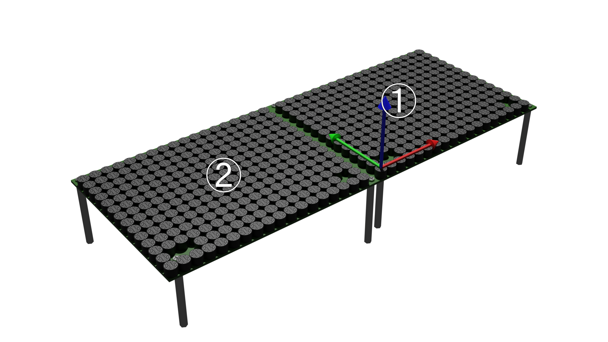

# Geometry

In this chapter, we explain about `Geometry`.
`Geometry` manages how AUTD3 devices are placed in the real world.

[[_TOC_]]

## Connect multiple devices

AUTD3 devices can be connected to each other via the daisy chain.
SDK is designed to be used transparently even if multiple devices are connected.

To use multiple devices, connect the PC and the EtherCAT In of the first device with an Ethernet cable, and connect the EtherCAT Out of the $i$-th device and the EtherCAT In of the $i+1$-th device with an Ethernet cable (See [Concept](concept.md)).

In SDK, you must call `add_device` function **in the order of the connected devices** when using multiple devices.

<figure>
  
</figure>

For example, suppose you have two devices as shown in the figure above.
The left device is the first device, and the right device is the second device.
Then, the code is as follows.

```rust,edition2021
{{#include ../../codes/Users_Manual/geometry_0.rs}}
```

```cpp
{{#include ../../codes/Users_Manual/geometry_0.cpp}}
```

```cs
{{#include ../../codes/Users_Manual/geometry_0.cs}}
```

```python
{{#include ../../codes/Users_Manual/geometry_0.py}}
```

Here, the first argument of the `AUTD3` constructor is the position, and the second argument is the rotation.
The rotation is specified by ZYZ Euler angles or quaternions.
Also, `AUTD3::DEVICE_WIDTH` is the width of the device (including the outline of the board).
In this example, no rotation is performed, so the second argument can be zero.

<figure>
  
</figure>

And, for example, suppose you have two devices as shown in the figure above, where the global origin is set to the left device.
Then, the code is as follows.

```rust,edition2021
{{#include ../../codes/Users_Manual/geometry_1.rs}}
```

```cpp
{{#include ../../codes/Users_Manual/geometry_1.cpp}}
```

```cs
{{#include ../../codes/Users_Manual/geometry_1.cs}}
```

```python
{{#include ../../codes/Users_Manual/geometry_1.py}}
```

<figure>
  
</figure>

Furthermore, for example, suppose you have two devices as shown in the figure above, where the global origin is set to the lower device.
Then, the code is as follows.

```rust,edition2021
{{#include ../../codes/Users_Manual/geometry_2.rs}}
```

```cpp
{{#include ../../codes/Users_Manual/geometry_2.cpp}}
```

```cs
{{#include ../../codes/Users_Manual/geometry_2.cs}}
```

```python
{{#include ../../codes/Users_Manual/geometry_2.py}}
```

<figure>
  
</figure>

## Device/Transducer index

Devices are assigned indices starting from 0 in the order in which they are connected to the PC.

Also, each device has 249 transducers, and local indices are assigned ([see the concept](./concept.md) for the surface photo of AUTD).

## Geometry API

- `num_devices`: Get the number of devices
- `num_transducers`: Get the number of all transducers
- `center`: Get the center of all transducers

```rust,edition2021
{{#include ../../codes/Users_Manual/geometry_3.rs}}
```

```cpp
{{#include ../../codes/Users_Manual/geometry_3.cpp}}
```

```cs
{{#include ../../codes/Users_Manual/geometry_3.cs}}
```

```python
{{#include ../../codes/Users_Manual/geometry_3.py}}
```

### Device access

`Geometry` is a container of `Device`.

To access `Device`, use indexer.
Or, you can use an iterator.

```rust,edition2021
{{#include ../../codes/Users_Manual/geometry_4.rs}}
```

```cpp
{{#include ../../codes/Users_Manual/geometry_4.cpp}}
```

```cs
{{#include ../../codes/Users_Manual/geometry_4.cs}}
```

```python
{{#include ../../codes/Users_Manual/geometry_4.py}}
```

## Device API

- `idx`: Index of the device
- `enable`: Enable flag. If it is off, the data of the device will not be updated.
  - Note that this only controls whether the data is updated or not, and does not stop the output.
- `sound_speed`: Get/set the speed of sound. The unit is mm/s.
- `set_sound_speed_from_temp`: Set the sound speed from the temperature. The unit of the temperature is Celsius. The default sound speed is $340\times 10^{3}\,\mathrm{mm/s}$, which corresponds to the sound speed of air at about 15 degrees Celsius. Note that there is a function with the same name in `Geometry`, and you can set the sound speed from the temperature for all devices by using it.
- `attenuation`: Get/set the attenuation coefficient. The unit is Np/mm.
- `translate`: Apply translation
- `rotate`: Apply rotation
- `affine`: Apply affine transformation (translation/rotation)

```rust,edition2021
{{#include ../../codes/Users_Manual/device_0.rs}}
```

```cpp
{{#include ../../codes/Users_Manual/device_0.cpp}}
```

```cs
{{#include ../../codes/Users_Manual/device_0.cs}}
```

```python
{{#include ../../codes/Users_Manual/device_0.py}}
```

### Transducer access

`Device` is a container of `Transducer`, and `Transducer` contains information of each transducer.

To access `Transducer`, use the indexer.
Or, you can use an iterator.

```rust,edition2021
{{#include ../../codes/Users_Manual/device_1.rs}}
```

```cpp
{{#include ../../codes/Users_Manual/device_1.cpp}}
```

```cs
{{#include ../../codes/Users_Manual/device_1.cs}}
```

```python
{{#include ../../codes/Users_Manual/device_1.py}}
```

## Transducer API

Following methods are available for `Transducer`.

- `idx`: Get the local index of the transducer.
- `position`: Get the position of the transducer.
- `rotation`: Get the rotation of the transducer. The rotation is represented by a quaternion.
- `x_direction`: Get the x direction vector of the transducer.
- `y_direction`: Get the y direction vector of the transducer.
- `z_direction`: Get the z direction vector of the transducer.
- `wavelength`: Get the wavelength of the transducer. You need to pass the sound speed as an argument.
- `wavenumber`: Get the wavenumber of the transducer. You need to pass the sound speed as an argument.

```rust,edition2021
{{#include ../../codes/Users_Manual/transducer_0.rs}}
```

```cpp
{{#include ../../codes/Users_Manual/transducer_0.cpp}}
```

```cs
{{#include ../../codes/Users_Manual/transducer_0.cs}}
```

```python
{{#include ../../codes/Users_Manual/transducer_0.py}}
```
