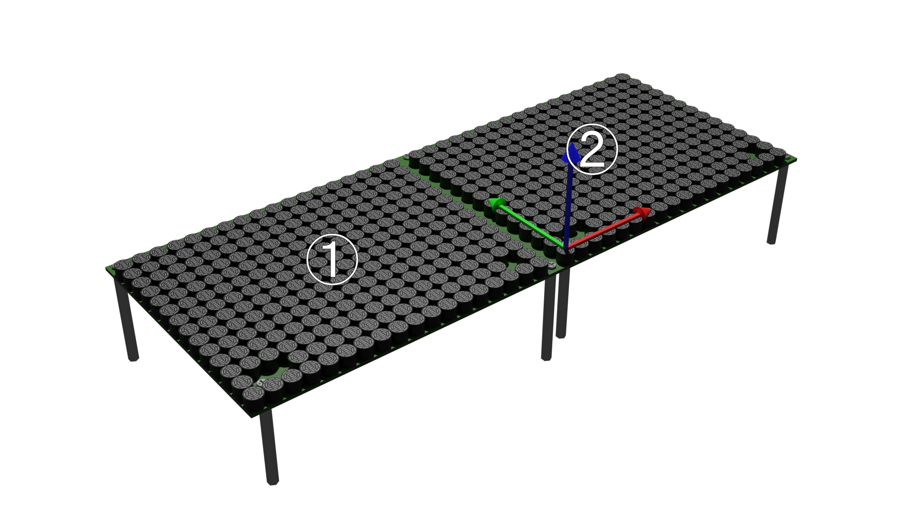

# Geometry

In this chapter, we explain about `Geometry`.
`Geometry` manages how AUTD3 devices are placed in the real world.

[[_TOC_]]

## Connect multiple devices

AUTD3 devices can be connected to each other via the daisy chain.
SDK is designed to be used transparently even if multiple devices are connected.

To use multiple devices, connect the PC and the EtherCAT In of the first device with an Ethernet cable, and connect the EtherCAT Out of the $i$-th device and the EtherCAT In of the $i+1$-th device with an Ethernet cable (See [Concept](concept.md)).

In SDK, you must call `add_device` function **in the order of the connected devices** when using multiple devices.

<figure>
  
</figure>

For example, suppose you have two devices as shown in the figure above.
The left device is the first device, and the right device is the second device.
Then, the code is as follows.

```rust,edition2021
# extern crate autd3;
# use autd3::prelude::*;
# use autd3::link::Debug;
# 
# fn main() -> Result<(), Box<dyn std::error::Error>> {
let autd = Controller::builder()
    .add_device(AUTD3::new(Vector3::zeros(), Vector3::zeros()))
    .add_device(AUTD3::new(Vector3::new(AUTD3::DEVICE_WIDTH, 0., 0.), Vector3::zeros()))
#    .open_with(Debug::new())?;
# Ok(())
# }
```

```cpp
auto autd = autd3::Controller::builder()
                .add_device(autd3::AUTD3(autd3::Vector3::Zero(), autd3::Vector3::Zero()))
                .add_device(autd3::AUTD3(autd3::Vector3(autd3::AUTD3::AUTD3::DEVICE_WIDTH, 0, 0), autd3::Vector3::Zero()))
```

```cs
var autd = Controller.Builder()
    .AddDevice(new AUTD3(Vector3d.zero, Vector3d.zero))
    .AddDevice(new AUTD3(new Vector3d(AUTD3.DeviceWidth, 0, 0), Vector3d.zero))
```

```python
auto = Controller.builder()\
        .add_device(AUTD3.from_euler_zyz([0.0, 0.0, 0.0], [0.0, 0.0, 0.0]))\
        .add_device(AUTD3.from_euler_zyz([AUTD3.device_width(), 0.0, 0.0], [0.0, 0.0, 0.0]))\
```

Here, the first argument of the `AUTD3` constructor is the position, and the second argument is the rotation.
The rotation is specified by ZYZ Euler angles or quaternions.
Also, `AUTD3::DEVICE_WIDTH` is the width of the device (including the outline of the board).
In this example, no rotation is performed, so the second argument can be zero.

<figure>
  
</figure>

And, for example, suppose you have two devices as shown in the figure above, where the global origin is set to the left device.
Then, the code is as follows.

```rust,edition2021
# extern crate autd3;
# use autd3::prelude::*;
# use autd3::link::Debug;
# 
# fn main() -> Result<(), Box<dyn std::error::Error>> {
let autd = Controller::builder()
    .add_device(AUTD3::new(Vector3::new(-AUTD3::DEVICE_WIDTH, 0., 0.), Vector3::zeros()))
    .add_device(AUTD3::new(Vector3::zeros(), Vector3::zeros()))
#    .open_with(Debug::new())?;
# Ok(())
# }
```

```cpp
auto autd = autd3::Controller::builder()
                .add_device(autd3::AUTD3(autd3::Vector3(-autd3::AUTD3::AUTD3::DEVICE_WIDTH, 0, 0), autd3::Vector3::Zero()))
                .add_device(autd3::AUTD3(autd3::Vector3::Zero(), autd3::Vector3::Zero()))
```

```cs
var autd = Controller.Builder()
    .AddDevice(new AUTD3(new Vector3d(-AUTD3.DeviceWidth, 0, 0), Vector3d.zero))
    .AddDevice(new AUTD3(Vector3d.zero, Vector3d.zero))
```

```python
auto = Controller.builder()\
        .add_device(AUTD3.from_euler_zyz([-AUTD3.device_width(), 0.0, 0.0], [0.0, 0.0, 0.0]))\
        .add_device(AUTD3.from_euler_zyz([0.0, 0.0, 0.0], [0.0, 0.0, 0.0]))\
```

<figure>
  
</figure>

Furthermore, for example, suppose you have two devices as shown in the figure above, where the global origin is set to the lower device.
Then, the code is as follows.

```rust,edition2021
# extern crate autd3;
# use autd3::prelude::*;
# use autd3::link::Debug;
# 
# fn main() -> Result<(), Box<dyn std::error::Error>> {
let autd = Controller::builder()
    .add_device(AUTD3::new(Vector3::zeros(), Vector3::zeros()))
    .add_device(AUTD3::new(Vector3::new(0., 0., AUTD3::DEVICE_WIDTH), Vector3::new(0., PI/2.0, 0.)))
#    .open_with(Debug::new())?;
# Ok(())
# }
```

```cpp
auto autd = autd3::Controller::builder()
                .add_device(autd3::AUTD3(autd3::Vector3::Zero(), autd3::Vector3::Zero()))
                .add_device(autd3::AUTD3(autd3::Vector3(0, 0, autd3::AUTD3::AUTD3::DEVICE_WIDTH), autd3::Vector3(0, autd3::pi/2.0, 0)))
```

```cs
var autd = Controller.Builder()
    .AddDevice(new AUTD3(Vector3d.zero, Vector3d.zero))
    .AddDevice(new AUTD3(new Vector3d(0, 0, AUTD3.DeviceWidth), new Vector3d(0, AUTD3.Pi/2, 0)))
```

```python
autd = Controller.builder()\
        .add_device(AUTD3.from_euler_zyz([0.0, 0.0, 0.0], [0.0, 0.0, 0.0]))\
        .add_device(AUTD3.from_euler_zyz([0.0, 0.0, AUTD3.device_width()], [0.0, np.pi/2, 0.0]))\
```

<figure>
  
</figure>

## Device/Transducer index

Devices are assigned indices starting from 0 in the order in which they are connected to the PC.

Also, each device has 249 transducers, and local indices are assigned ([see the concept](./concept.md) for the surface photo of AUTD).

## Geometry API

### num_devices/num_transducers

You can get the number of devices and transducers by `num_devices` and `num_transducers` methods.

```rust,edition2021
# extern crate autd3;
# use autd3::prelude::*;
# use autd3::link::Debug;
# 
# fn main() -> Result<(), Box<dyn std::error::Error>> {
# let mut autd = Controller::builder()
#     .add_device(AUTD3::new(Vector3::zeros(), Vector3::zeros()))
#     .add_device(AUTD3::new(Vector3::new(0., 0., AUTD3::DEVICE_WIDTH), Vector3::new(0., PI/2.0, 0.)))
#    .open_with(Debug::new())?;
let num_dev = autd.geometry().num_devices();
let num_tr = autd.geometry().num_transducers();
# Ok(())
# }
```

```cpp
const auto num_dev = autd.geometry().num_devices();
const auto num_tr= autd.geometry().num_transducers();
```

```cs
var numDev = autd.Geometry.NumDevices;
var numTr = autd.Geometry.NumTransducers;
```

```python
num_dev = autd.geometry.num_devices
num_tr = autd.geometry.num_transducers
```

### center

You can get the center of all devices with `center`.

```rust,edition2021
# extern crate autd3;
# use autd3::prelude::*;
# use autd3::link::Debug;
# 
# fn main() -> Result<(), Box<dyn std::error::Error>> {
# let mut autd = Controller::builder()
#     .add_device(AUTD3::new(Vector3::zeros(), Vector3::zeros()))
#     .add_device(AUTD3::new(Vector3::new(0., 0., AUTD3::DEVICE_WIDTH), Vector3::new(0., PI/2.0, 0.)))
#    .open_with(Debug::new())?;
let center = autd.geometry().center();
# Ok(())
# }
```

```cpp
const autd3::Vector3 center = autd.geometry().center();
```

```cs
var center = autd.Geometry.Center;
```

```python
center = autd.geometry.center
```

### Device access

`Geometry` is a container of `Device`.

To access `Device`, use indexer.

```rust,edition2021
# extern crate autd3;
# use autd3::prelude::*;
# use autd3::link::Debug;
# 
# fn main() -> Result<(), Box<dyn std::error::Error>> {
# let mut autd = Controller::builder()
#     .add_device(AUTD3::new(Vector3::zeros(), Vector3::zeros()))
#     .add_device(AUTD3::new(Vector3::new(0., 0., AUTD3::DEVICE_WIDTH), Vector3::new(0., PI/2.0, 0.)))
#    .open_with(Debug::new())?;
let dev = &autd.geometry()[0];
# Ok(())
# }
```

```cpp
const auto& dev = autd.geometry()[0];
```

```cs
var dev = autd.Geometry[0];
```

```python
dev = autd.geometry[0]
```

Or, you can use an iterator.

```rust,edition2021
# extern crate autd3;
# use autd3::prelude::*;
# use autd3::link::Debug;
# 
# fn main() -> Result<(), Box<dyn std::error::Error>> {
# let mut autd = Controller::builder()
#     .add_device(AUTD3::new(Vector3::zeros(), Vector3::zeros()))
#     .add_device(AUTD3::new(Vector3::new(0., 0., AUTD3::DEVICE_WIDTH), Vector3::new(0., PI/2.0, 0.)))
#    .open_with(Debug::new())?;
for dev in autd.geometry().iter() {
  // do something
}
# Ok(())
# }
```

```cpp
for (const auto& dev : autd.geometry()){
  // do something
}
```

```cs
foreach (var dev in autd.Geometry) {
  // do something
}
```

```python
for dev in autd.geometry:
  # do something
```

## Device API

### Idx

Get the index of the device with `idx` method.

### Speed of sound

When calculating the phase of the transducer, there are some cases where the wavelength is required.
The wavelength $\lambda$ of the sound wave is calculated from the sound speed $v$ and the frequency $f$ as $\lambda = v/f$.
The `sound_speed` member of `Geometry` represents this sound speed $v$.

```rust,edition2021
# extern crate autd3;
# use autd3::prelude::*;
# use autd3::link::Debug;
# 
# fn main() -> Result<(), Box<dyn std::error::Error>> {
# let mut autd = Controller::builder()
#     .add_device(AUTD3::new(Vector3::zeros(), Vector3::zeros()))
#     .add_device(AUTD3::new(Vector3::new(0., 0., AUTD3::DEVICE_WIDTH), Vector3::new(0., PI/2.0, 0.)))
#    .open_with(Debug::new())?;
autd.geometry_mut()[0].sound_speed = 340e3;
# Ok(())
# }
```

```cpp
autd.geometry()[0].set_sound_speed(340e3);
```

```cs
autd.Geometry[0].SoundSpeed = 340e3;
```

```python
autd.geometry[0].sound_speed = 340e3
```

The unit of the sound speed is mm/s.

You can also set the sound speed from the temperature.

```rust,edition2021
# extern crate autd3;
# use autd3::prelude::*;
# use autd3::link::Debug;
# 
# fn main() -> Result<(), Box<dyn std::error::Error>> {
# let mut autd = Controller::builder()
#     .add_device(AUTD3::new(Vector3::zeros(), Vector3::zeros()))
#     .add_device(AUTD3::new(Vector3::new(0., 0., AUTD3::DEVICE_WIDTH), Vector3::new(0., PI/2.0, 0.)))
#    .open_with(Debug::new())?;
autd.geometry_mut()[0].set_sound_speed_from_temp(15.);
# Ok(())
# }
```

```cpp
autd.geometry()[0].set_sound_speed_from_temp(15);
```

```cs
autd.Geometry[0].SetSoundSpeedFromTemp(15);
```

```python
autd.geometry[0].set_sound_speed_from_temp(15)
```

The unit of the temperature is Celsius.

### Attenuation coefficient

In the SDK, the sound pressure $p(\br)$ at the position $\br$ of the emitted ultrasonic wave from the transducer is modeled as
$$
  p(\br) = \frac{D(\theta)}{\|\br\|}\rme^{-\|\br\|\alpha}\rme^{-\im k \|\br\|}
$$
where $D(\theta)$ is the directivity, $k = 2\pi / \lambda$ is the wave number, and $\alpha$ is the attenuation coefficient.
`attenuation` member of `Device` represents this attenuation coefficient $\alpha$.

```rust,edition2021
# extern crate autd3;
# use autd3::prelude::*;
# use autd3::link::Debug;
# 
# fn main() -> Result<(), Box<dyn std::error::Error>> {
# let mut autd = Controller::builder()
#     .add_device(AUTD3::new(Vector3::zeros(), Vector3::zeros()))
#     .add_device(AUTD3::new(Vector3::new(0., 0., AUTD3::DEVICE_WIDTH), Vector3::new(0., PI/2.0, 0.)))
#    .open_with(Debug::new())?;
autd.geometry_mut()[0].attenuation = 0.;
# Ok(())
# }
```

```cpp
autd.geometry()[0].set_attenuation(0.0);
```

```cs
autd.Geometry[0].Attenuation = 0.0;
```

```python
autd.geometry[0].attenuation = 0.0
```

The unit of the attenuation coefficient is Np/mm

The default value is 0.0.

### Affine transformation

To modify the position of the device added to `Geometry`, use the following functions.
- `translate`
- `rotate`
- `affine`

```rust,edition2021
# extern crate autd3;
# use autd3::prelude::*;
# use autd3::link::Debug;
# 
# fn main() -> Result<(), Box<dyn std::error::Error>> {
# let mut autd = Controller::builder()
#     .add_device(AUTD3::new(Vector3::zeros(), Vector3::zeros()))
#     .add_device(AUTD3::new(Vector3::new(0., 0., AUTD3::DEVICE_WIDTH), Vector3::new(0., PI/2.0, 0.)))
#    .open_with(Debug::new())?;
let t = Vector3::new(1., 0., 0.);
let r = UnitQuaternion::from_quaternion(Quaternion::new(1., 0., 0., 0.));
autd.geometry_mut()[0].translate(t);
autd.geometry_mut()[0].rotate(r);
autd.geometry_mut()[0].affine(t, r);
# Ok(())
# }
```

```cpp
const autd3::Vector3 t(1, 0, 0);
const autd3::Quaternion r(1, 0, 0, 0);
autd.geometry()[0].translate(t);
autd.geometry()[0].rotate(r);
autd.geometry()[0].affine(t, r);
```

```cs
var t = new Vector3d(1, 0, 0);
var r = new Quaterniond(1, 0, 0, 0);
autd.Geometry[0].Translate(t);
autd.Geometry[0].Rotate(r);
autd.Geometry[0].Affine(t, r);
```

```python
t = np.array([1.0, 0.0, 0.0])
r = np.array([1.0, 0.0, 0.0, 0.0])
autd.geometry[0].translate(t)
autd.geometry[0].rotate(r)
autd.geometry[0].affine(t, r)
```

### force_fan

AUTD3 device has a fan, and it has three fan modes: Auto, Off, and On.
In Auto mode, the temperature monitoring IC monitors the temperature of the IC, and when it exceeds a certain temperature, the fan starts automatically.
In Off mode, the fan is always off, and in On mode, the fan is always on.

The fan mode is switched by the jumper switch next to the fan.
As shown in the figure below, the fan side is shorted to switch to Auto, the center is Off, and the right is On.

<figure>
  
  <figcaption>Jumper switch to specify fan mode</figcaption>
</figure>

`force_fan` flag is a flag to force the fan to start in Auto mode.

```rust,edition2021
# extern crate autd3;
# use autd3::prelude::*;
# #[allow(unused_variables)]
# fn main() -> Result<(), Box<dyn std::error::Error>> {
# let mut autd = Controller::builder().add_device(AUTD3::new(Vector3::zeros(), Vector3::zeros())).open_with(autd3::link::Debug::new()).unwrap();
autd.geometry_mut()[0].force_fan = true;
# Ok(())
# }
```

```cpp
autd.geometry()[0].force_fan(true);
```

```cs
autd.Geometry[0].ForceFan = true;
```

```python
autd.geometry[0].force_fan = True
```

The flag is actually updated when some data is sent.
If you want to update only the flag, send `UpdateFlags`.

```rust,edition2021
# extern crate autd3;
# use autd3::prelude::*;
# #[allow(unused_variables)]
# fn main() -> Result<(), Box<dyn std::error::Error>> {
# let mut autd = Controller::builder().add_device(AUTD3::new(Vector3::zeros(), Vector3::zeros())).open_with(autd3::link::NullLink {}).unwrap();
autd.geometry_mut()[0].force_fan = true;
autd.send(UpdateFlags::new())?;
# Ok(())
# }
```

```cpp
autd.geometry()[0].force_fan(true);
autd.send(autd3::UpdateFlags());
```

```cs
autd.Geometry[0].ForceFan = true;
autd.Send(new UpdateFlags());
```

```python
autd.force_fan(True)
autd.geometry[0].force_fan = True
```

## reads_fpga_info

`reads_fpga_info` flag is a flag to read the FPGA status.

See [Controller/fpga_info](./controller.md#fpga_info) for details.

### Transducer access

`Device` is a container of `Transducer`, and `Transducer` contains information of each transducer.

To access `Transducer`, use the indexer.

```rust,edition2021
# extern crate autd3;
# use autd3::prelude::*;
# use autd3::link::Debug;
# 
# fn main() -> Result<(), Box<dyn std::error::Error>> {
# let mut autd = Controller::builder()
#     .add_device(AUTD3::new(Vector3::zeros(), Vector3::zeros()))
#     .add_device(AUTD3::new(Vector3::new(0., 0., AUTD3::DEVICE_WIDTH), Vector3::new(0., PI/2.0, 0.)))
#    .open_with(Debug::new())?;
let tr = &autd.geometry()[0][0];
# Ok(())
# }
```

```cpp
const auto& tr = autd.geometry()[0][0];
```

```cs
var tr = autd.Geometry[0][0];
```

```python
tr = autd.geometry[0][0]
```

Or, you can use an iterator.

```rust,edition2021
# extern crate autd3;
# use autd3::prelude::*;
# use autd3::link::Debug;
# 
# fn main() -> Result<(), Box<dyn std::error::Error>> {
# let mut autd = Controller::builder()
#     .add_device(AUTD3::new(Vector3::zeros(), Vector3::zeros()))
#     .add_device(AUTD3::new(Vector3::new(0., 0., AUTD3::DEVICE_WIDTH), Vector3::new(0., PI/2.0, 0.)))
#    .open_with(Debug::new())?;
for tr in autd.geometry()[0].iter() {
  // do something
}
# Ok(())
# }
```

```cpp
for (const auto& tr : autd.geometry()[0]) {
  // do something
}
```

```cs
foreach (var tr in autd.Geometry[0]) {
  // do something
}
```

```python
for tr in autd.geometry[0]:
  # do something
```

## Transducer API

### local_idx

Get the local index of the transducer.

```rust,edition2021
# extern crate autd3;
# use autd3::prelude::*;
# use autd3::link::Debug;
# 
# fn main() -> Result<(), Box<dyn std::error::Error>> {
# let mut autd = Controller::builder()
#     .add_device(AUTD3::new(Vector3::zeros(), Vector3::zeros()))
#     .add_device(AUTD3::new(Vector3::new(0., 0., AUTD3::DEVICE_WIDTH), Vector3::new(0., PI/2.0, 0.)))
#    .open_with(Debug::new())?;
# let tr = &autd.geometry()[0][0];
let idx = tr.local_idx();
# Ok(())
# }
```

```cpp
const auto idx = tr.local_idx();
```

```cs
var idx = tr.LocalIdx;
```

```python
idx = tr.idx
```

### position/rotation

Get the position and rotation of the transducer.
The rotation is represented by a quaternion.

```rust,edition2021
# extern crate autd3;
# use autd3::prelude::*;
# use autd3::link::Debug;
# 
# fn main() -> Result<(), Box<dyn std::error::Error>> {
# let mut autd = Controller::builder()
#     .add_device(AUTD3::new(Vector3::zeros(), Vector3::zeros()))
#     .add_device(AUTD3::new(Vector3::new(0., 0., AUTD3::DEVICE_WIDTH), Vector3::new(0., PI/2.0, 0.)))
#    .open_with(Debug::new())?;
# let tr = &autd.geometry()[0][0];
let position = tr.position();
let rotation = tr.rotation();
# Ok(())
# }
```

```cpp
const auto position = tr.position();
const auto rotation = tr.rotation();
```

```cs
var position = tr.Position;
var rotation = tr.Rotation;
```

```python
position = tr.position
rotation = tr.rotation
```

### x_direction/y_direction/z_direction

Get the direction of the transducer.

```rust,edition2021
# extern crate autd3;
# use autd3::prelude::*;
# use autd3::link::Debug;
# 
# fn main() -> Result<(), Box<dyn std::error::Error>> {
# let mut autd = Controller::builder()
#     .add_device(AUTD3::new(Vector3::zeros(), Vector3::zeros()))
#     .add_device(AUTD3::new(Vector3::new(0., 0., AUTD3::DEVICE_WIDTH), Vector3::new(0., PI/2.0, 0.)))
#    .open_with(Debug::new())?;
# let tr = &autd.geometry()[0][0];
let x_dir = tr.x_direction();
let y_dir = tr.y_direction();
let z_dir = tr.z_direction();
# Ok(())
# }
```

```cpp
const auto x_dir = tr.x_direction();
const auto y_dir = tr.y_direction();
const auto z_dir = tr.z_direction();
```

```cs
var xDir = tr.XDirection;
var yDir = tr.YDirection;
var zDir = tr.ZDirection;
```

```python
x_dir = tr.x_direction
y_dir = tr.y_direction
z_dir = tr.z_direction
```

### mod_delay

Set/get the modulation delay of the transducer.

See [Modulation](./modulation.md) for more details.

```rust,edition2021
# extern crate autd3;
# use autd3::prelude::*;
# use autd3::link::Debug;
# 
# fn main() -> Result<(), Box<dyn std::error::Error>> {
# let mut autd = Controller::builder()
#     .add_device(AUTD3::new(Vector3::zeros(), Vector3::zeros()))
#     .add_device(AUTD3::new(Vector3::new(0., 0., AUTD3::DEVICE_WIDTH), Vector3::new(0., PI/2.0, 0.)))
#    .open_with(Debug::new())?;
# let mut tr = &mut autd.geometry_mut()[0][0];
let delay = tr.mod_delay();
tr.set_mod_delay(0);
# Ok(())
# }
```

```cpp
const auto delay = tr.mod_delay();
tr.set_mod_delay(0);
```

```cs
var delay = tr.ModDelay;
tr.ModDelay = 0;
```

```python
delay = tr.mod_delay
tr.mod_delay = 0
```

### amp_filter/phase_filter

Set/Get amplitude and phase filter.
See [Filter](./filter.md) for details.

```rust,edition2021
# extern crate autd3;
# use autd3::prelude::*;
# use autd3::link::Debug;
# 
# fn main() -> Result<(), Box<dyn std::error::Error>> {
# let mut autd = Controller::builder()
#     .add_device(AUTD3::new(Vector3::zeros(), Vector3::zeros()))
#     .add_device(AUTD3::new(Vector3::new(0., 0., AUTD3::DEVICE_WIDTH), Vector3::new(0., PI/2.0, 0.)))
#    .open_with(Debug::new())?;
# let mut tr = &mut autd.geometry_mut()[0][0];
let amp_filter = tr.amp_filter();
tr.set_amp_filter(-0.5);
let phase_filter = tr.phase_filter();
tr.set_phase_filter(PI);
# Ok(())
# }
```

```cpp
const auto amp_filter = tr.amp_filter();
tr.set_amp_filter(-0.5);
const auto phase_filter = tr.phase_filter();
tr.set_phase_filter(autd3::pi);
```

```cs
var ampFilter = tr.AmpFilter;
tr.AmpFilter = -0.5;
var phaseFilter = tr.PhaseFilter;
tr.PhaseFilter = Math.PI;
```

```python
amp_filter = tr.amp_filter
tr.amp_filter = -0.5
phase_filter = tr.phase_filter
tr.phase_filter = math.pi
```

### cycle

Set/get the cycle of the transducer.

> Note: The cycle setting is not available in Legacy mode.

```rust,edition2021
# extern crate autd3;
# use autd3::prelude::*;
# use autd3::link::Debug;
# 
# fn main() -> Result<(), Box<dyn std::error::Error>> {
# let mut autd = Controller::builder()
#     .advanced()
#     .add_device(AUTD3::new(Vector3::zeros(), Vector3::zeros()))
#     .add_device(AUTD3::new(Vector3::new(0., 0., AUTD3::DEVICE_WIDTH), Vector3::new(0., PI/2.0, 0.)))
#    .open_with(Debug::new())?;
# let mut tr = &mut autd.geometry_mut()[0][0];
let cycle = tr.cycle();
tr.set_cycle(4096)?;
# Ok(())
# }
```

```cpp
const auto cycle = tr.cycle();
tr.set_cycle(4096);
```

```cs
var cycle = tr.Cycle;
tr.Cycle = 4096;
```

```python
cycle = tr.cycle
tr.cycle = 4096
```

The default value is $4096 (\ufreq)$.

See, [Mode configuration / Changing the frequency](./advanced_examples/freq_config.md) for more details.

### frequency/set_frequency

Set/get the frequency of the transducer.
When setting the frequency $f$, the closest period $N$ to $\clkf/f$ is selected.

> Note: The frequency setting is not available in Legacy mode.

```rust,edition2021
# extern crate autd3;
# use autd3::prelude::*;
# use autd3::link::Debug;
# 
# fn main() -> Result<(), Box<dyn std::error::Error>> {
# let mut autd = Controller::builder()
#     .advanced()
#     .add_device(AUTD3::new(Vector3::zeros(), Vector3::zeros()))
#     .add_device(AUTD3::new(Vector3::new(0., 0., AUTD3::DEVICE_WIDTH), Vector3::new(0., PI/2.0, 0.)))
#    .open_with(Debug::new())?;
# let mut tr = &mut autd.geometry_mut()[0][0];
let freq = tr.frequency();
tr.set_frequency(40e3)?;
# Ok(())
# }
```

```cpp
const auto freq = tr.frequency();
tr.set_frequency(40e3);
```

```cs
var freq = tr.Frequency;
tr.Frequency = 40e3;
```

```python
freq = tr.frequency
tr.frequency = 40e3
```

The default value is $\ufreq$.

See, [Mode configuration / Changing the frequency](./advanced_examples/freq_config.md) for more details.

### wavelength/wavenumber

Get the wavelength and wavenumber of the transducer.

You need to pass the speed of sound as an argument to `wavelength` and `wavenumber`.

```rust,edition2021
# extern crate autd3;
# use autd3::prelude::*;
# use autd3::link::Debug;
# 
# fn main() -> Result<(), Box<dyn std::error::Error>> {
# let mut autd = Controller::builder()
#     .advanced()
#     .add_device(AUTD3::new(Vector3::zeros(), Vector3::zeros()))
#     .add_device(AUTD3::new(Vector3::new(0., 0., AUTD3::DEVICE_WIDTH), Vector3::new(0., PI/2.0, 0.)))
#    .open_with(Debug::new())?;
# let sound_speed = autd.geometry()[0].sound_speed;
# let mut tr = &mut autd.geometry_mut()[0][0];
let wavelen = tr.wavelength(sound_speed);
let wavenum = tr.wavenumber(sound_speed);
# Ok(())
# }
```

```cpp
const auto wavelen = tr.wavelength(sound_speed);
const auto wavenum = tr.wavenumber(sound_speed);
```

```cs
var wavelen = tr.Wavelength(soundSpeed);
var wavenum = tr.Wavenumber(soundSpeed);
```

```python
wavelen = tr.wavelength(sound_speed)
wavenum = tr.wavenumber(sound_speed)
```
