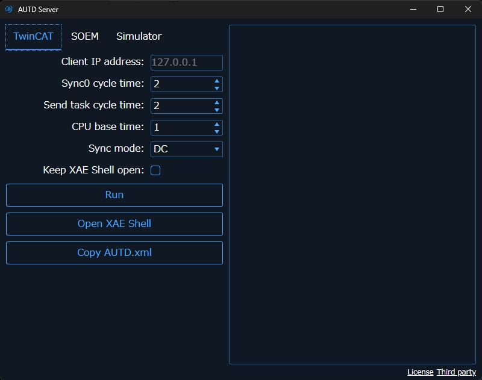

# TwinCAT

TwinCAT is a software that enables EtherCAT communication on Windows.
TwinCAT is the only official way to use EtherCAT on Windows.
TwinCAT is a very special software that supports only Windows and forcibly real-timeizes Windows.

You have to use a specific network controller to use TwinCAT.
Please see [List of supported network controllers](https://infosys.beckhoff.com/english.php?content=../content/1033/tc3_overview/9309844363.html&id=).

> Note: Alternatively, after installing TwinCAT, you can check the Vendor ID and Device ID of the corresponding device in `C:/TwinCAT/3.1/Driver/System/TcI8254x.inf`, and check it against "Device Manager" → "Ethernet Adapter" → "Property" → "Details" → "Hardware ID" to confirm.

The NIC other than the above may work, but in that case, normal operation and real-time performance are not guaranteed.

[[_TOC_]]

## TwinCAT installation

TwinCAT can not coexist with Hyper-V or Virtual Machine Platform.
Therefore, it is necessary to disable these functions.
For example, start PowerShell with administrator privileges and type the following:

```PowerShell
Disable-WindowsOptionalFeature -Online -FeatureName Microsoft-Hyper-V-Hypervisor
Disable-WindowsOptionalFeature -Online -FeatureName VirtualMachinePlatform
```

First, download TwinCAT XAE from the [official site](https://www.beckhoff.com/en-en/).
To download, you need to register (free).

After downloading, run the installer and follow the instructions.
At this time, **check** "TwinCAT XAE Shell install" and **uncheck** "Visual Studio Integration".

After installation, restart the PC and run `C:/TwinCAT/3.1/System/win8settick.bat` as an administrator, and restart again.

## AUTD Server

To use TwinCAT Link, install `AUTD Server` first.
The AUTD server's installer is distributed on [GitHub Releases](https://github.com/shinolab/autd3/releases).

When you run `AUTD Server`, the following screen will appear, so open the "TwinCAT" tab.

<figure>
  
</figure>

### Config file and driver installation

At the first time, you need to install configuration file and driver for EherCAT.

First click "Copy AUTD.xml" button.
If you see a message like "AUTD.xml is successfully copied", it is successful.

Then, click "Open XAE shell" button".
Open the upper menu of TwinCAT XAE Shell, select "TwinCAT" → "Show Realtime Ethernet Compatible Devices", select the corresponding device in "Compatible devices", and click "Install".
If you see the installed device in "Installed and ready to use devices (realtime capable)", it is successful.

Note: If "Compatible devices" is not displayed, the Ethernet device on that PC is not compatible with TwinCAT.
In that case, you can install the driver in "Incompatible devices", but it is not guaranteed to work.

### License

In addition, the first time you run it, you will get a license error.
Open "Solution Explorer" → "SYSTEM" → "License" in XAE Shell, click "7 Days Trial License ...", and enter the characters displayed on the screen.
Note that the license is a 7-day trial license, but you can reissue it by doing the same thing again.
After issuing the license, close TwinCAT XAE Shell and run again.

### Run AUTD Server

Connect AUTD3 devices and PC, and power on the devices.
Then, click "Run" button on AUTD Server.
Here, let "Client IP address" be empty.

If you got a message like "AUTDs are found and added", it is successful.

<figure>
  
</figure>

## TwinCAT link API

### Constructor

```rust,should_panic,edition2021
{{#include ../../../codes/Users_Manual/link/twincat_0.rs}}
```

```cpp
{{#include ../../../codes/Users_Manual/link/twincat_0.cpp}}
```

```cs
{{#include ../../../codes/Users_Manual/link/twincat_0.cs}}
```

```python
{{#include ../../../codes/Users_Manual/link/twincat_0.py}}
```

## Troubleshooting

When using a large number of devices, the following error may occur.

<figure>
  
  <figcaption>TwinCAT error when using 9 devices</figcaption>
</figure>

In this case, increase the values of the `Sync0 cycle time` and `Send task cycle time` options of `AUTD Server` and run again.

The values should be as small as possible while no error occurs.

# RemoteTwinCAT

As mentioned above, AUTD3 and TwinCAT can only be used on Windows OS.
If you want to develop on a PC other than Windows, you can use `RemoteTwinCAT` link to remotely operate TwinCAT from Linux/macOS.

## Setup

You need to prepare two PCs to use RemoteTwinCAT.
In this case, one of the PCs must be able to use the above TwinCAT link.
This PC is called "server" here.
On the other hand, there are no particular restrictions on the PC on the development side, that is, the side using the SDK, and it just needs to be connected to the same LAN as the server.

First, connect the server and the AUTD device.
The LAN adapter used at this time must be a TwinCAT compatible adapter, just like the TwinCAT link.
Also, connect the server and the client on different LANs.
The LAN adapter here does not need to be TwinCAT compatible.
Then, check the IP of the LAN between the server and the client.
Here, for example, the server side is "172.16.99.104", and the client side is "172.16.99.62".

Next, start `AUTD Server` on the server.
At this time, specify the IP address of the client (in this example, `172.16.99.62`) with the `Client IP address` option.

<figure>
  
</figure>

You can see "Server AmsNetId" and "Client AmsNetId" on the right panel.

## RemoteTwinCAT link API

### Constructor

You must specify the "Server AmsNetId" in the constructor of `RemoteTwinCAT` link.

And, specify the "Client AmsNetId" in the `with_client_ams_net_id` method.
Also, specify the IP address of the server in the `with_server_ip` method.
These two values is optional, but it is recommended to specify them.

```rust,should_panic,edition2021
{{#include ../../../codes/Users_Manual/link/remote_twincat_0.rs}}
```

```cpp
{{#include ../../../codes/Users_Manual/link/remote_twincat_0.cpp}}
```

```cs
{{#include ../../../codes/Users_Manual/link/remote_twincat_0.cs}}
```

```python
{{#include ../../../codes/Users_Manual/link/remote_twincat_0.py}}
```

## Firewall

If you get a TCP-related error when using RemoteTwinCAT, the ADS protocol may be blocked by the firewall.
In that case, allow the connection of TCP/UDP port 48898 in the firewall settings.
