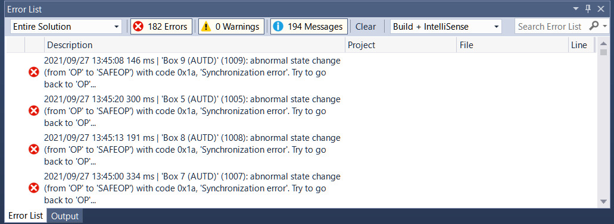

[[_TOC_]]

# TwinCAT

TwinCAT is a software that enables EtherCAT communication on Windows.
TwinCAT is the only official way to use EtherCAT on Windows.
TwinCAT is a very special software that supports only Windows and forcibly real-timeizes Windows.

You have to use a specific network controller to use TwinCAT.
Please see [List of supported network controllers](https://infosys.beckhoff.com/english.php?content=../content/1033/tc3_overview/9309844363.html&id=).

> Note: Alternatively, after installing TwinCAT, you can check the Vendor ID and Device ID of the corresponding device in `C:/TwinCAT/3.1/Driver/System/TcI8254x.inf`, and check it against "Device Manager" → "Ethernet Adapter" → "Property" → "Details" → "Hardware ID" to confirm.

The NIC other than the above may work, but in that case, normal operation and real-time performance are not guaranteed.

## TwinCAT installation

TwinCAT can not coexist with Hyper-V or Virtual Machine Platform.
Therefore, it is necessary to disable these functions.
For example, start PowerShell with administrator privileges and type the following:

```PowerShell
Disable-WindowsOptionalFeature -Online -FeatureName Microsoft-Hyper-V-Hypervisor
Disable-WindowsOptionalFeature -Online -FeatureName VirtualMachinePlatform
```

First, download TwinCAT XAE from the [official site](https://www.beckhoff.com/en-en/).
To download, you need to register (free).

After downloading, run the installer and follow the instructions.
At this time, **check** "TwinCAT XAE Shell install" and **uncheck** "Visual Studio Integration".

After installation, restart the PC and run `C:/TwinCAT/3.1/System/win8settick.bat` as an administrator, and restart again.

Finally, copy `dist/TwinCATAUTDServer/AUTD.xml` in the SDK to `C:/TwinCAT/3.1/Config/Io/EtherCAT`.

## TwinCATAUTDServer

To use TwinCAT Link, first run `dist/TwinCATAUTDServer/TwinCATAUTDServer.exe`.

At the first time, you need to run `TwinCATAUTDServer.exe` with `-k` option to install the driver.

```shell
TwinCATAUTDServer.exe -k
```

> Note: If you accidentally close the window, you can open `%TEMP%/TwinCATAUTDServer/TwinCATAUTDServer.sln` as a TcXaeShell Application. `%TEMP%` is an environment variable, usually `C:/Users/(user name)/AppData/Local/Temp`.

Note that TwinCATAUTDServer will lose the Link when the PC is turned off or enters sleep mode, so you need to run it again each time.

### Driver installation

At the first time, you need to install the driver for EherCAT.
Open the upper menu of TwinCAT XAE Shell, select "TwinCAT" → "Show Realtime Ethernet Compatible Devices", select the corresponding device in "Compatible devices", and click "Install".
If you see the installed device in "Installed and ready to use devices (realtime capable)", it is successful.

Note: If "Compatible devices" is not displayed, the Ethernet device on that PC is not compatible with TwinCAT.
In that case, you can install the driver in "Incompatible devices", but it is not guaranteed to work.

### License

In addition, the first time you run it, you will get a license error.
Open "Solution Explorer" → "SYSTEM" → "License" in XAE Shell, click "7 Days Trial License ...", and enter the characters displayed on the screen.
Note that the license is a 7-day trial license, but you can reissue it by doing the same thing again.
After issuing the license, close TwinCAT XAE Shell and run `TwinCATAUTDServer.exe` again.

## TwinCAT link API

### Constructor

```rust,should_panic
# use autd3::prelude::*;
use autd3_link_twincat::TwinCAT;

# #[allow(unused_variables)]
# fn main() -> Result<(), Box<dyn std::error::Error>> {
# let autd = Controller::builder()
#     .add_device(AUTD3::new(Vector3::zeros(), Vector3::zeros()))
#     .add_device(AUTD3::new(Vector3::new(0., 0., DEVICE_WIDTH), Vector3::new(0., PI/2.0, 0.)))
#     .open_with(
TwinCAT::new()?
# )?;
# Ok(())
# }
```

```cpp
#include "autd3/link/twincat.hpp"

autd3::link::TwinCAT();
```

```cs
new TwinCAT();
```

```python
from pyautd3.link import TwinCAT

TwinCAT()
```

## Troubleshooting

When using a large number of devices, the following error may occur.

<figure>
  
  <figcaption>TwinCAT error when using 9 devices</figcaption>
</figure>

In this case, increase the values of the `-s` and `-t` options of `TwinCATAUTDServer` and run TwinCATAUTDServer again.

```shell
TwinCATAUTDServer.exe -s 3 -t 3
```

The values should be as small as possible while no error occurs.

# RemoteTwinCAT

As mentioned above, AUTD3 and TwinCAT can only be used on Windows OS.
If you want to develop on a PC other than Windows, you can use `RemoteTwinCAT` link to remotely operate TwinCAT from Linux/macOS.

## Setup

You need to prepare two PCs to use RemoteTwinCAT.
In this case, one of the PCs must be able to use the above TwinCAT link.
This PC is called "server" here.
On the other hand, there are no particular restrictions on the PC on the development side, that is, the side using the SDK, and it just needs to be connected to the same LAN as the server.

<figure>
  
  <figcaption>Network Configuration</figcaption>
</figure>

First, connect the server and the AUTD device.
The LAN adapter used at this time must be a TwinCAT compatible adapter, just like the TwinCAT link.
Also, connect the server and the client on different LANs.
The LAN adapter here does not need to be TwinCAT compatible.
Then, check the IP of the LAN between the server and the client.
Here, for example, the server side is "169.254.205.219", and the client side is "169.254.175.45".

Next, start `TwinCATAUTDServer` on the server.
At this time, specify the IP address of the client (in this example, `169.254.175.45`) with the `-c` option.
And, add the `-k` option at the end to keep TwinCATAUTDServer open.

```ignore
TwinCATAUTDServer.exe -c 169.254.175.45 -k
```

And, as shown in the figure below, open System → Routes and check the Local NetId in the NetId Management tab.

<figure>
  
  <figcaption>Server AmsNetId</figcaption>
</figure>

Here, we assume that it was "172.16.99.194.1.1"

Also, check the client's AMS NetId.
You can check this by opening "System" → "Routes" in TwinCAT, and checking the AmsNetId in the "Current Route" tab.

<figure>
  
  <figcaption>Client AmsNetId</figcaption>
</figure>

## RemoteTwinCAT link API

### Constructor

You must specify the server's NetId in the constructor of `RemoteTwinCAT` link.

And, specify the client's NetId in the `with_client_ams_net_id` method.
Also, specify the IP address of the server in the `with_server_ip` method.
These two values is optional, but it is recommended to specify them.

```rust,should_panic
# use autd3::prelude::*;
use autd3_link_twincat::RemoteTwinCAT;

# #[allow(unused_variables)]
# fn main() -> Result<(), Box<dyn std::error::Error>> {
# let autd = Controller::builder()
#     .add_device(AUTD3::new(Vector3::zeros(), Vector3::zeros()))
#     .add_device(AUTD3::new(Vector3::new(0., 0., DEVICE_WIDTH), Vector3::new(0., PI/2.0, 0.)))
#      .open_with(
RemoteTwinCAT::new("172.16.99.194.1.1")?
            .with_server_ip("169.254.205.219")
            .with_client_ams_net_id("169.254.175.45.1.1")
# )?;
# Ok(())
# }
```

```cpp
#include "autd3/link/twincat.hpp"

autd3::link::RemoteTwinCAT("172.16.99.194.1.1")
				.with_server_ip("169.254.205.219")
				.with_client_ams_net_id("169.254.175.45.1.1");
```

```cs
new RemoteTwinCAT("172.16.99.194.1.1")
        .WithServerIp(IPAddress.Parse("169.254.205.219"))
        .WithClientAmsNetId("169.254.175.45.1.1");
```

```python
from pyautd3.link import RemoteTwinCAT

RemoteTwinCAT("172.16.99.194.1.1")\
    .with_server_ip("169.254.205.219")\
    .with_client_ams_net_id("169.254.175.45.1.1")
```

## Firewall

If you get a TCP-related error when using RemoteTwinCAT, the ADS protocol may be blocked by the firewall.
In that case, allow the connection of TCP/UDP port 48898 in the firewall settings.

