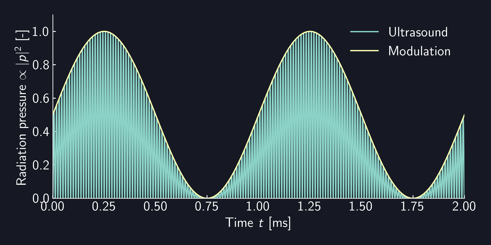

# RadiationPressure

`RadiationPressure` is a `Modulation` to apply modulation to radiation pressure (proportional to the square of the sound pressure) instead of sound pressure.

For example, if you use `RadiationPressure` on `Sine` modulation with $\SI{1}{kHz}$, the radiation pressure of the sound pressure amplitude is as follows, and the envelope of the radiation pressure follows the $\SI{1}{kHz}$ sine wave.

<figure>
  
</figure>

```rust,edition2021
{{#include ../../../codes/Users_Manual/modulation/radiation_0.rs}}
```

```cpp
{{#include ../../../codes/Users_Manual/modulation/radiation_0.cpp}}
```

```cs
{{#include ../../../codes/Users_Manual/modulation/radiation_0.cs}}
```

```python
{{#include ../../../codes/Users_Manual/modulation/radiation_0.py}}
```
