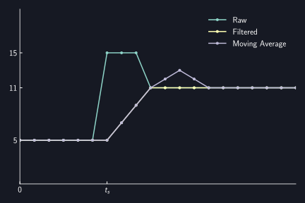

# Silencer

AUTD3 has a silencer to mute the output.
The silencer suppresses the rapid change in the drive signal of the transducer and mutes the output.

## Theory

The silencer is based on the paper by Suzuki et al.[^suzuki2020].

As a rough outline,
- Amplitude modulation of ultrasound produces audible sound.
- When driving an ultrasound transducer, phase changes cause amplitude fluctuations.
  - Therefore, audible noise is generated.
- Amplitude fluctuations can be suppressed by linearly interpolating phase changes and changing them stepwise.
  - Therefore, noise can be reduced by doing fine interpolation.
- The silencer is a method to reduce noise by doing fine interpolation.

## Silencer Config

To configure the silencer, send `Silencer` to the controller.

You can set `step` to `Silencer`.
Refer to the followwing for details.
Roughly, the smaller the `step`, the quieter it becomes.

The silencer is enabled by default.
To disable the silencer, send `Silencer::disable`.

```rust,edition2021
{{#include ../../codes/Users_Manual/silencer_0.rs}}
```

```cpp
{{#include ../../codes/Users_Manual/silencer_0.cpp}}
```

```cs
{{#include ../../codes/Users_Manual/silencer_0.cs}}
```

```python
{{#include ../../codes/Users_Manual/silencer_0.py}}
```


## Phase change by Silencer

Silencer changes the phase $P$ linearly and stepwise to mute the output.
In other words, it is almost equivalent to passing the phase $P$ time series data through a (simple) moving average filter.
However, it differs in that it takes into account the fact that the phase data is periodic.

For example, consider the case where the period $T$ of the ultrasound is $T=12$.
In other words, $P=0$ corresponds to $0\,\mathrm{rad}$ and $P=12$ corresponds to $2\pi\,\mathrm{rad}$.
Here, suppose that the phase changes from $P=2$ to $P=6$ at time $t_s$.
The phase change by Silencer is as follows.

<figure>
  
<figcaption>Change of phase $P$</figcaption>
</figure>

On the other hand, suppose that the phase changes from $P=2$ to $P=10$ at time $t_s$.
The phase change by Silencer is as follows.
This is because $P=-2$ is closer to $P=2$ than $P=10$ in terms of the phase.

<figure>
  
<figcaption>Change of phase $P$</figcaption>
</figure>

That is, Silencer updates the phase $P$ as follows for the current $P$ and the target value $P_r$.
$$
    P \leftarrow \begin{cases}
        P + \mathrm{sign}(P_r - P) \min (|P_r - P|, \Delta) & \text{if } |P_r - P| \le T/2\\
        P - \mathrm{sign}(P_r - P) \min (|P_r - P|, \Delta) & \text{(otherwise)}\\
    \end{cases}.
$$
Where $\Delta$ is the update amount per step (`step` of `Silencer`).
And the update frequency is $\ufreq$.

Small $\Delta$ makes the phase change smoother and reduces noise.

<figure>
  
<figcaption>Phase change over $\Delta$</figcaption>
</figure>

According to this implementation, the behavior is different from the moving average filter.
One is when the phase change amount shown above is larger than $\pi$, and the other is when the phase changes again in the middle.
Examples of phase changes at this time are shown below.

<figure>
  
<figcaption>Comparison against moving average filter</figcaption>
</figure>

## Duty change by Silencer

Amplitude modulation of ultrasound produces audible sound.
So, AM noise can be reduced by applying a filter to the duty ratio $D$.

Unlike the phase, the duty ratio $D$ is not periodic with respect to the period $T$.
Therefore, the duty ratio $D$ is updated as follows for the current $D$ and the target value $D_r$.
$$
    D \leftarrow D + \mathrm{sign}(D_r - D) \min (|D_r - D|, \Delta),
$$

[^suzuki2020]: Suzuki, Shun, et al. "Reducing amplitude fluctuation by gradual phase shift in midair ultrasound haptics." IEEE transactions on haptics 13.1 (2020): 87-93.
