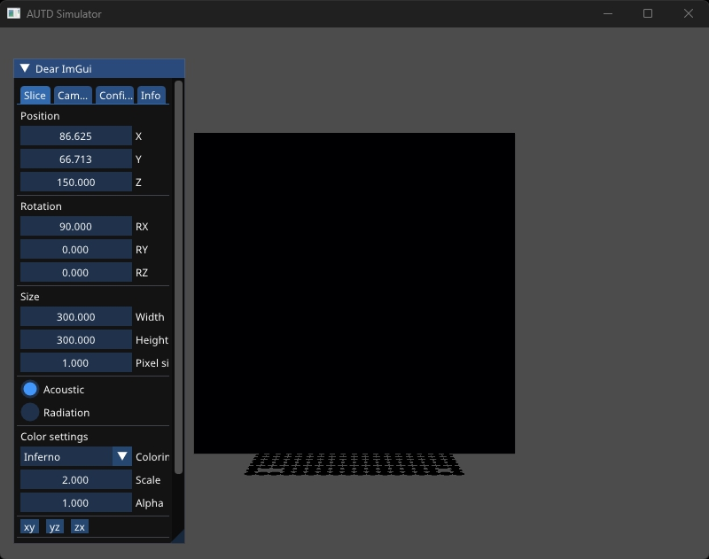

# AUTD3 Simulator

AUTD Simulator (以下, シミュレータ) はその名の通りAUTDのシミュレータであり, Windows/Linux/macOSで動作する.

## AUTD Server

シミュレータは`AUTD Server`に付属している.
[GitHub Releases](https://github.com/shinolab/autd3/releases)にてインストーラを配布しているので, これをダウンロードし, 指示に従ってインストールする.

`AUTD Server`を実行すると, 以下のような画面になるので, `Simulator`タブを開き, `Run`ボタンを押すとシミュレータが起動する.

<figure>
  
</figure>

シミュレータが起動すると接続待ちの状態になる.

<figure>
  
</figure>

この状態で, `Simulator`リンクを使って`Controller`を`open`すると, シミュレータ上には, 振動子の位置に円と, 画面中央に黒いパネルが表示される.

<figure>
  
</figure>

この黒いパネルを"Slice"と呼び, この"Slice"を使って任意の位置の音場を可視化できる.
また, その時, 振動子の位相が色相で, 振幅が色強度で表される.

<figure>
  
</figure>

なお, シミュレータで表示される音場はシンプルな球面波の重ね合わせであり, 指向性や非線形効果などは考慮されない.

画面左に表示されているGUIでSliceやカメラの操作が行える.
なお, GUIには[Dear ImGui](https://github.com/ocornut/imgui)を用いており, マウスによる操作のほか, "Ctrl+クリック"で数値入力モードになる.

### Sliceタブ

SliceタブではSliceの大きさと位置, 回転を変えられる.
回転はXYZのオイラー角で指定する.
なお, 「xy」, 「yz」, 「zx」ボタンを押すと, Sliceを各平面に平行な状態へ回転させる.

また, 音圧を表示する「Acoustic」モードか, その2乗の値を表示する「Radiation」モードを選択できる.

また, 「Color settings」の項目ではカラーリングのパレットの変更や, color scale, Slice自体のアルファ値の変更ができる.
大量のデバイスを使用すると色が飽和する場合があるので, その時はColor scaleの値を大きくすれば良い.

### Cameraタブ

Cameraタブではカメラの位置, 回転, Field of View, Near clip, Far clipの設定を変えられる.
回転はXYZのオイラー角で指定する.

### Configタブ

Configタブでは音速とフォントサイズ, 及び, 背景色の設定ができる.

また, 各デバイスごとのshow/enable/overheatの設定を切り替えられる.
showをOffにした場合は, 表示されないだけで音場に寄与する.
enableをOffにすると音場に寄与しなくなる.
また, overheatをOnにすると, 温度センサがアサートされた状態を模擬できる.

「View as device」をOnにすると, 振動子を単なる円ではなく, AUTD3の3Dモデルで表示する.

### Infoタブ

Infoタブでは, FPSや各デバイス毎のSilencerやModulation, STMの情報が確認できる.

Silencerの設定は確認できるがこれは音場には反映されない.

「Mod enable」をOnにすると, Modulationが音場に反映されるようになる.

ModulationとSTMは実時間を元にどのインデックスのデータを出力するかを決めている.
この時間を表すのが, 「System time」であり, 2000年1月1日0時0分0秒からの経過時間をナノ秒単位で表す.

「Auto play」をOnにすると「System time」が自動的に設定される.
そうでない場合は, 手動で時間を進めることができる.

### その他

「Save image as file」にて, 現在のSliceに表示されている音場を画像で保存できる.

「Auto」ボタンはカメラを自動的に適当な場所に移動させる.
「Reset」は起動時の状態にリセットする.
「Default」はデフォルトの設定にリセットする.

また, 設定は"settings.json"に保存される.
このファイルからしか変更できないものとして`vsync`がある.
`vsync`を`false`にすると垂直同期が無効になる.
