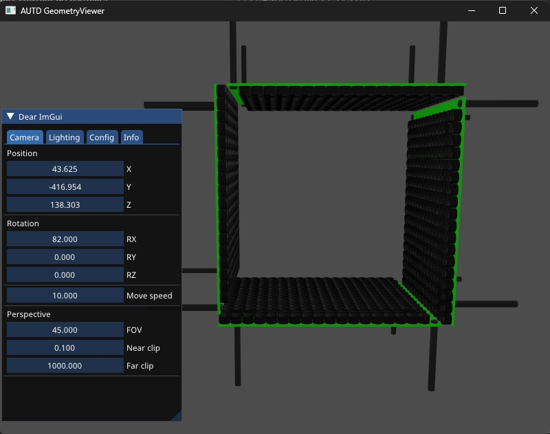

# Geometry

この章ではGeometryについて解説する.
GeometryはAUTD3デバイスが現実世界でどのように配置されているかを管理している.

[[_TOC_]]

## 複数デバイスの接続

AUTD3のデバイスは複数台をデイジーチェーンで接続できるようになっている.
SDKは複数台を接続したとしても, 透過的に使用できるように設計されている.

複数のデバイスを接続する場合は,
PCと1台目のEtherCAT Inをケーブルでつなぎ, $i$台目のEtherCAT Outと$i+1$台目のEtherCAT Inをケーブルで接続する ([Concept](concept.md)参照).

なお, 電源も相互に接続でき, 電源コネクタは3つの内で好きなところを使って良い.

> NOTE: AUTD3は最大でデバイスあたり$\SI{2}{A}$の電流を消費する. 電源の最大出力電流に注意されたい.

SDKで複数台のデバイスを使用する場合は`add_device`関数を**接続したデバイスの順に**呼び出す必要がある.

<figure>
  
</figure>

例えば, 上図のように配置・接続しており, 図左側のデバイスが1台目, 右側のデバイスが2台目だとする.
さらに, グローバル座標を1台目のローカル座標と同じようにとるとすると,

```rust,edition2021
# extern crate autd3;
# use autd3::prelude::*;
# use autd3::link::Debug;
# 
# fn main() -> Result<(), Box<dyn std::error::Error>> {
let autd = Controller::builder()
    .add_device(AUTD3::new(Vector3::zeros(), Vector3::zeros()))
    .add_device(AUTD3::new(Vector3::new(AUTD3::DEVICE_WIDTH, 0., 0.), Vector3::zeros()))
#    .open_with(Debug::new())?;
# Ok(())
# }
```

```cpp
auto autd = autd3::Controller::builder()
                .add_device(autd3::AUTD3(autd3::Vector3::Zero(), autd3::Vector3::Zero()))
                .add_device(autd3::AUTD3(autd3::Vector3(autd3::AUTD3::AUTD3::DEVICE_WIDTH, 0, 0), autd3::Vector3::Zero()))
```

```cs
var autd = Controller.Builder()
    .AddDevice(new AUTD3(Vector3d.zero, Vector3d.zero))
    .AddDevice(new AUTD3(new Vector3d(AUTD3.DeviceWidth, 0, 0), Vector3d.zero))
```

```python
auto = Controller.builder()\
        .add_device(AUTD3.from_euler_zyz([0.0, 0.0, 0.0], [0.0, 0.0, 0.0]))\
        .add_device(AUTD3.from_euler_zyz([AUTD3::DEVICE_WIDTH, 0.0, 0.0], [0.0, 0.0, 0.0]))\
```

とすれば良い.
ここで, `AUTD3`コンストラクタの第1引数は位置, 第2引数は回転を表す.
回転はZYZのオイラー角, または, クオータニオンで指定する.
また, `AUTD3::DEVICE_WIDTH`はデバイスの (基板外形を含めた) 横幅である.
この例では, 回転はしないので, 第2引数はゼロで良い.

<figure>
  
</figure>

また, 例えば上図のように, グローバル座標を2台目のローカル座標と同じようにとるとすると,

```rust,edition2021
# extern crate autd3;
# use autd3::prelude::*;
# use autd3::link::Debug;
# 
# fn main() -> Result<(), Box<dyn std::error::Error>> {
let autd = Controller::builder()
    .add_device(AUTD3::new(Vector3::new(-AUTD3::DEVICE_WIDTH, 0., 0.), Vector3::zeros()))
    .add_device(AUTD3::new(Vector3::zeros(), Vector3::zeros()))
#    .open_with(Debug::new())?;
# Ok(())
# }
```

```cpp
auto autd = autd3::Controller::builder()
                .add_device(autd3::AUTD3(autd3::Vector3(-autd3::AUTD3::AUTD3::DEVICE_WIDTH, 0, 0), autd3::Vector3::Zero()))
                .add_device(autd3::AUTD3(autd3::Vector3::Zero(), autd3::Vector3::Zero()))
```

```cs
var autd = Controller.Builder()
    .AddDevice(new AUTD3(new Vector3d(-AUTD3.DeviceWidth, 0, 0), Vector3d.zero))
    .AddDevice(new AUTD3(Vector3d.zero, Vector3d.zero))
```

```python
auto = Controller.builder()\
        .add_device(AUTD3.from_euler_zyz([-AUTD3::DEVICE_WIDTH, 0.0, 0.0], [0.0, 0.0, 0.0]))\
        .add_device(AUTD3.from_euler_zyz([0.0, 0.0, 0.0], [0.0, 0.0, 0.0]))\
```
とすれば良い.

<figure>
  
</figure>

さらに, 例えば, 上図のように配置されており, 下が1台目, 左が2台目で, グローバル座標を1台目のローカル座標と同じだとすると,

```rust,edition2021
# extern crate autd3;
# use autd3::prelude::*;
# use autd3::link::Debug;
# 
# fn main() -> Result<(), Box<dyn std::error::Error>> {
let autd = Controller::builder()
    .add_device(AUTD3::new(Vector3::zeros(), Vector3::zeros()))
    .add_device(AUTD3::new(Vector3::new(0., 0., AUTD3::DEVICE_WIDTH), Vector3::new(0., PI/2.0, 0.)))
#    .open_with(Debug::new())?;
# Ok(())
# }
```

```cpp
auto autd = autd3::Controller::builder()
                .add_device(autd3::AUTD3(autd3::Vector3::Zero(), autd3::Vector3::Zero()))
                .add_device(autd3::AUTD3(autd3::Vector3(0, 0, autd3::AUTD3::AUTD3::DEVICE_WIDTH), autd3::Vector3(0, autd3::pi/2.0, 0)))
```

```cs
var autd = Controller.Builder()
    .AddDevice(new AUTD3(Vector3d.zero, Vector3d.zero))
    .AddDevice(new AUTD3(new Vector3d(0, 0, AUTD3.DeviceWidth), new Vector3d(0, AUTD3.Pi/2, 0)))
```

```python
autd = Controller.builder()\
        .add_device(AUTD3.from_euler_zyz([0.0, 0.0, 0.0], [0.0, 0.0, 0.0]))\
        .add_device(AUTD3.from_euler_zyz([0.0, 0.0, AUTD3::DEVICE_WIDTH], [0.0, np.pi/2, 0.0]))\
```

のように指定する.

<figure>
  
</figure>

`add_device`を呼び出す順番は接続した順番に依存することに注意する.
例えば, 上図のように配置・接続しており, 図右側のデバイスが1台目, 左側のデバイスが2台目だとする.
この場合は, 右側のデバイスの座標を先に指定する必要がある.

SDKにおけるAPIでは, すべてグローバル座標を用いるため, 接続するデバイスの数に依存せず透過的に使用できる.

## デバイス/振動子のインデックス

デバイスには接続された順に0から始まるインデックスが割り当てられる.

また, 各デバイスは$249$個の振動子が配置されており, ローカルインデックスが割り振られている ([コンセプト](./concept.md)の「AUTDの表面写真」を参照).

## GeometryのAPI

### num_devices/num_transducers

`num_devices`でデバイスの数, `num_transducers`で全振動子の数を取得できる.

```rust,edition2021
# extern crate autd3;
# use autd3::prelude::*;
# use autd3::link::Debug;
# 
# fn main() -> Result<(), Box<dyn std::error::Error>> {
# let mut autd = Controller::builder()
#     .add_device(AUTD3::new(Vector3::zeros(), Vector3::zeros()))
#     .add_device(AUTD3::new(Vector3::new(0., 0., AUTD3::DEVICE_WIDTH), Vector3::new(0., PI/2.0, 0.)))
#    .open_with(Debug::new())?;
let num_dev = autd.geometry().num_devices();
let num_tr = autd.geometry().num_transducers();
# Ok(())
# }
```

```cpp
const auto num_dev = autd.geometry().num_devices();
const auto num_tr= autd.geometry().num_transducers();
```

```cs
var numDev = autd.Geometry.NumDevices;
var numTr = autd.Geometry.NumTransducers;
```

```python
num_dev = autd.geometry.num_devices
num_tr = autd.geometry.num_transducers
```

### center

`center`で全振動子の中心を取得できる.

```rust,edition2021
# extern crate autd3;
# use autd3::prelude::*;
# use autd3::link::Debug;
# 
# fn main() -> Result<(), Box<dyn std::error::Error>> {
# let mut autd = Controller::builder()
#     .add_device(AUTD3::new(Vector3::zeros(), Vector3::zeros()))
#     .add_device(AUTD3::new(Vector3::new(0., 0., AUTD3::DEVICE_WIDTH), Vector3::new(0., PI/2.0, 0.)))
#    .open_with(Debug::new())?;
let center = autd.geometry().center();
# Ok(())
# }
```

```cpp
const autd3::Vector3 center = autd.geometry().center();
```

```cs
var center = autd.Geometry.Center;
```

```python
center = autd.geometry.center
```

### 音速の設定

`set_sound_speed_from_temp`/`set_sound_speed_from_temp_with`ですべてのデバイスに対して音速を設定できる.
詳しくは, [DeviceのAPI/音速の設定](#音速の設定-1)を参照.

### Deviceの取得

`Geometry`は`Device`のコンテナになっており, `Device`が`Transducer`のコンテナになっている.

`Device`を取得するには, インデクサを使用する.
例えば, 0番目のデバイスを取得するには以下のようにする.

```rust,edition2021
# extern crate autd3;
# use autd3::prelude::*;
# use autd3::link::Debug;
# 
# fn main() -> Result<(), Box<dyn std::error::Error>> {
# let mut autd = Controller::builder()
#     .add_device(AUTD3::new(Vector3::zeros(), Vector3::zeros()))
#     .add_device(AUTD3::new(Vector3::new(0., 0., AUTD3::DEVICE_WIDTH), Vector3::new(0., PI/2.0, 0.)))
#    .open_with(Debug::new())?;
let dev = &autd.geometry()[0];
# Ok(())
# }
```

```cpp
const auto& dev = autd.geometry()[0];
```

```cs
var dev = autd.Geometry[0];
```

```python
dev = autd.geometry[0]
```

あるいは, イテレータを使用することもできる.

```rust,edition2021
# extern crate autd3;
# use autd3::prelude::*;
# use autd3::link::Debug;
# 
# fn main() -> Result<(), Box<dyn std::error::Error>> {
# let mut autd = Controller::builder()
#     .add_device(AUTD3::new(Vector3::zeros(), Vector3::zeros()))
#     .add_device(AUTD3::new(Vector3::new(0., 0., AUTD3::DEVICE_WIDTH), Vector3::new(0., PI/2.0, 0.)))
#    .open_with(Debug::new())?;
for dev in autd.geometry().iter() {
  // do something
}
# Ok(())
# }
```

```cpp
for (const auto& dev : autd.geometry()){
  // do something
}
```

```cs
foreach (var dev in autd.Geometry) {
  // do something
}
```

```python
for dev in autd.geometry:
  # do something
```

## DeviceのAPI

### Idx

デバイスのインデックスを取得する.

### 音速の設定

振動子の位相を計算する際に, 波長が必要な場面がある.
音波の波長$\lambda$は, 音速$v$と周波数$f$から$\lambda = v/f$と計算される.
`Device`の`sound_speed`メンバーがこの音速$v$を表している.

```rust,edition2021
# extern crate autd3;
# use autd3::prelude::*;
# use autd3::link::Debug;
# 
# fn main() -> Result<(), Box<dyn std::error::Error>> {
# let mut autd = Controller::builder()
#     .add_device(AUTD3::new(Vector3::zeros(), Vector3::zeros()))
#     .add_device(AUTD3::new(Vector3::new(0., 0., AUTD3::DEVICE_WIDTH), Vector3::new(0., PI/2.0, 0.)))
#    .open_with(Debug::new())?;
autd.geometry_mut()[0].sound_speed = 340e3;
# Ok(())
# }
```

```cpp
autd.geometry()[0].set_sound_speed(340e3);
```

```cs
autd.Geometry[0].SoundSpeed = 340e3;
```

```python
autd.geometry[0].sound_speed = 340e3
```

音速の単位はmm/sである.

温度からも音速を設定できる.
これには, `set_sound_speed_from_temp`関数を使用する.

```rust,edition2021
# extern crate autd3;
# use autd3::prelude::*;
# use autd3::link::Debug;
# 
# fn main() -> Result<(), Box<dyn std::error::Error>> {
# let mut autd = Controller::builder()
#     .add_device(AUTD3::new(Vector3::zeros(), Vector3::zeros()))
#     .add_device(AUTD3::new(Vector3::new(0., 0., AUTD3::DEVICE_WIDTH), Vector3::new(0., PI/2.0, 0.)))
#    .open_with(Debug::new())?;
autd.geometry_mut()[0].set_sound_speed_from_temp(15.);
# Ok(())
# }
```

```cpp
autd.geometry()[0].set_sound_speed_from_temp(15);
```

```cs
autd.Geometry[0].SetSoundSpeedFromTemp(15);
```

```python
autd.geometry[0].set_sound_speed_from_temp(15)
```

温度の単位は摂氏である.

デフォルトの音速は$340\times 10^{3}\,\mathrm{mm/s}$となっており, これは, およそ摂氏15度での空気の音速に相当する.

なお, `Geometry`にも同名の関数があり, それを使用することですべてのデバイスに対して温度から音速を設定できる.

### 減衰係数の設定

SDKでは, 振動子から放射された超音波の位置$\br$における音圧$p(\br)$は
$$
  p(\br) = \frac{D(\theta)}{\|\br\|}\rme^{-\|\br\|\alpha}\rme^{-\im k \|\br\|}
$$
のようにモデル化されている.
ここで, $D(\theta)$は指向性, $k = 2\pi / \lambda$は波数であり, $\alpha$が減衰係数である.
`Geometry`の`attenuation`メンバーがこの減衰係数$\alpha$を表している.

```rust,edition2021
# extern crate autd3;
# use autd3::prelude::*;
# use autd3::link::Debug;
# 
# fn main() -> Result<(), Box<dyn std::error::Error>> {
# let mut autd = Controller::builder()
#     .add_device(AUTD3::new(Vector3::zeros(), Vector3::zeros()))
#     .add_device(AUTD3::new(Vector3::new(0., 0., AUTD3::DEVICE_WIDTH), Vector3::new(0., PI/2.0, 0.)))
#    .open_with(Debug::new())?;
autd.geometry_mut()[0].attenuation = 0.;
# Ok(())
# }
```

```cpp
autd.geometry()[0].set_attenuation(0.0);
```

```cs
autd.Geometry[0].Attenuation = 0.0;
```

```python
autd.geometry[0].attenuation = 0.0
```

単位はNp/mmである.

デフォルトでは, $0$に設定されている.

### デバイスの移動/回転

デバイスの位置関係を変更するには, 以下の関数を使用する.

- `translate`: 平行移動
- `rotate`: 回転
- `affine`: アフィン変換 (平行移動/回転)

```rust,edition2021
# extern crate autd3;
# use autd3::prelude::*;
# use autd3::link::Debug;
# 
# fn main() -> Result<(), Box<dyn std::error::Error>> {
# let mut autd = Controller::builder()
#     .add_device(AUTD3::new(Vector3::zeros(), Vector3::zeros()))
#     .add_device(AUTD3::new(Vector3::new(0., 0., AUTD3::DEVICE_WIDTH), Vector3::new(0., PI/2.0, 0.)))
#    .open_with(Debug::new())?;
let t = Vector3::new(1., 0., 0.);
let r = UnitQuaternion::from_quaternion(Quaternion::new(1., 0., 0., 0.));
autd.geometry_mut()[0].translate(t);
autd.geometry_mut()[0].rotate(r);
autd.geometry_mut()[0].affine(t, r);
# Ok(())
# }
```

```cpp
const autd3::Vector3 t(1, 0, 0);
const autd3::Quaternion r(1, 0, 0, 0);
autd.geometry()[0].translate(t);
autd.geometry()[0].rotate(r);
autd.geometry()[0].affine(t, r);
```

### force_fan

AUTD3デバイスにはファンがついており, Auto, Off, Onの3つのファンモードが有る.
Autoモードでは温度監視ICがICの温度を監視し, 一定温度以上になると自動でファンを起動する.
Offモードではファンは常時オフであり, Onモードでは常時オンになる.

モードの切替は, ファン横のジャンパスイッチで行う. 少しわかりにくいが, 以下の図のようにファン側をショートするとAuto, 真ん中でOff, 右側でOnとなる.

<figure>
  
  <figcaption>AUTDファン制御用のジャンパスイッチ</figcaption>
</figure>

Autoモードの場合は温度が高くなると自動的にファンが起動する.
`force_fan`フラグはこのAutoモードでファンを強制的に起動するためのフラグである.

```rust,edition2021
# extern crate autd3;
# use autd3::prelude::*;
# #[allow(unused_variables)]
# fn main() -> Result<(), Box<dyn std::error::Error>> {
# let mut autd = Controller::builder().add_device(AUTD3::new(Vector3::zeros(), Vector3::zeros())).open_with(autd3::link::Debug::new()).unwrap();
autd.geometry_mut()[0].force_fan = true;
# Ok(())
# }
```

```cpp
autd.geometry()[0].force_fan(true);
```

```cs
autd.Geometry[0].ForceFan = true;
```

```python
autd.geometry[0].force_fan = True
```

実際にフラグが更新されるのは何らかのデータを送信したときになる.
フラグの更新だけがしたい場合は`UpdateFlags`を送信すれば良い.

```rust,edition2021
# extern crate autd3;
# use autd3::prelude::*;
# #[allow(unused_variables)]
# fn main() -> Result<(), Box<dyn std::error::Error>> {
# let mut autd = Controller::builder().add_device(AUTD3::new(Vector3::zeros(), Vector3::zeros())).open_with(autd3::link::NullLink {}).unwrap();
autd.geometry_mut()[0].force_fan = true;
autd.send(UpdateFlags::new())?;
# Ok(())
# }
```

```cpp
autd.geometry()[0].force_fan(true);
autd.send(autd3::UpdateFlags());
```

```cs
autd.Geometry[0].ForceFan = true;
autd.Send(new UpdateFlags());
```

```python
autd.force_fan(True)
autd.geometry[0].force_fan = True
```

## reads_fpga_info

FPGAの状態を取得するかどうか.

詳しくは[Controller/fpga_info](./controller.md#fpga_info)を参照.

### Transducerの取得

`Device`は`Transducer`のコンテナになっており, `Transducer`は各振動子の情報を格納している.

`Transducer`を取得するには, インデクサを使用する.
例えば, 0番目デバイスの0番目の振動子を取得するには以下のようにする.

```rust,edition2021
# extern crate autd3;
# use autd3::prelude::*;
# use autd3::link::Debug;
# 
# fn main() -> Result<(), Box<dyn std::error::Error>> {
# let mut autd = Controller::builder()
#     .add_device(AUTD3::new(Vector3::zeros(), Vector3::zeros()))
#     .add_device(AUTD3::new(Vector3::new(0., 0., AUTD3::DEVICE_WIDTH), Vector3::new(0., PI/2.0, 0.)))
#    .open_with(Debug::new())?;
let tr = &autd.geometry()[0][0];
# Ok(())
# }
```

```cpp
const auto& tr = autd.geometry()[0][0];
```

```cs
var tr = autd.Geometry[0][0];
```

```python
tr = autd.geometry[0][0]
```

あるいは, イテレータを使用することもできる.

```rust,edition2021
# extern crate autd3;
# use autd3::prelude::*;
# use autd3::link::Debug;
# 
# fn main() -> Result<(), Box<dyn std::error::Error>> {
# let mut autd = Controller::builder()
#     .add_device(AUTD3::new(Vector3::zeros(), Vector3::zeros()))
#     .add_device(AUTD3::new(Vector3::new(0., 0., AUTD3::DEVICE_WIDTH), Vector3::new(0., PI/2.0, 0.)))
#    .open_with(Debug::new())?;
for tr in autd.geometry()[0].iter() {
  // do something
}
# Ok(())
# }
```

```cpp
for (const auto& tr : autd.geometry()[0]) {
  // do something
}
```

```cs
foreach (var tr in autd.Geometry[0]) {
  // do something
}
```

```python
for tr in autd.geometry[0]:
  # do something
```

## TransducerのAPI

### local_idx

振動子の(ローカル)インデックスを取得する.

```rust,edition2021
# extern crate autd3;
# use autd3::prelude::*;
# use autd3::link::Debug;
# 
# fn main() -> Result<(), Box<dyn std::error::Error>> {
# let mut autd = Controller::builder()
#     .add_device(AUTD3::new(Vector3::zeros(), Vector3::zeros()))
#     .add_device(AUTD3::new(Vector3::new(0., 0., AUTD3::DEVICE_WIDTH), Vector3::new(0., PI/2.0, 0.)))
#    .open_with(Debug::new())?;
# let tr = &autd.geometry()[0][0];
let idx = tr.local_idx();
# Ok(())
# }
```

```cpp
const auto idx = tr.local_idx();
```

```cs
var idx = tr.Idx;
```

```python
idx = tr.idx
```

### position/rotation

位置, 及び, 回転を取得する.
回転はクオータニオンで表される.

```rust,edition2021
# extern crate autd3;
# use autd3::prelude::*;
# use autd3::link::Debug;
# 
# fn main() -> Result<(), Box<dyn std::error::Error>> {
# let mut autd = Controller::builder()
#     .add_device(AUTD3::new(Vector3::zeros(), Vector3::zeros()))
#     .add_device(AUTD3::new(Vector3::new(0., 0., AUTD3::DEVICE_WIDTH), Vector3::new(0., PI/2.0, 0.)))
#    .open_with(Debug::new())?;
# let tr = &autd.geometry()[0][0];
let position = tr.position();
let rotation = tr.rotation();
# Ok(())
# }
```

```cpp
const auto position = tr.position();
const auto rotation = tr.rotation();
```

```cs
var position = tr.Position;
var rotation = tr.Rotation;
```

```python
position = tr.position
rotation = tr.rotation
```

### x_direction/y_direction/z_direction

振動子のx,y,z方向ベクトルを取得する.

```rust,edition2021
# extern crate autd3;
# use autd3::prelude::*;
# use autd3::link::Debug;
# 
# fn main() -> Result<(), Box<dyn std::error::Error>> {
# let mut autd = Controller::builder()
#     .add_device(AUTD3::new(Vector3::zeros(), Vector3::zeros()))
#     .add_device(AUTD3::new(Vector3::new(0., 0., AUTD3::DEVICE_WIDTH), Vector3::new(0., PI/2.0, 0.)))
#    .open_with(Debug::new())?;
# let tr = &autd.geometry()[0][0];
let x_dir = tr.x_direction();
let y_dir = tr.y_direction();
let z_dir = tr.z_direction();
# Ok(())
# }
```

```cpp
const auto x_dir = tr.x_direction();
const auto y_dir = tr.y_direction();
const auto z_dir = tr.z_direction();
```

```cs
var xDir = tr.XDirection;
var yDir = tr.YDirection;
var zDir = tr.ZDirection;
```

```python
x_dir = tr.x_direction
y_dir = tr.y_direction
z_dir = tr.z_direction
```

### mod_delay

振動子のModulation delayを取得/設定する.
詳細は「[Modulation](./modulation.md)」を参照されたい.

```rust,edition2021
# extern crate autd3;
# use autd3::prelude::*;
# use autd3::link::Debug;
# 
# fn main() -> Result<(), Box<dyn std::error::Error>> {
# let mut autd = Controller::builder()
#     .add_device(AUTD3::new(Vector3::zeros(), Vector3::zeros()))
#     .add_device(AUTD3::new(Vector3::new(0., 0., AUTD3::DEVICE_WIDTH), Vector3::new(0., PI/2.0, 0.)))
#    .open_with(Debug::new())?;
# let mut tr = &mut autd.geometry_mut()[0][0];
let delay = tr.mod_delay();
tr.set_mod_delay(0);
# Ok(())
# }
```

```cpp
const auto delay = tr.mod_delay();
tr.set_mod_delay(0);
```

```cs
var delay = tr.ModDelay;
tr.ModDelay = 0;
```

```python
delay = tr.mod_delay
tr.mod_delay = 0
```

### amp_filter/phase_filter

振動子の振幅フィルタ/位相フィルタを取得/設定する.
詳細は「[Filter](./filter.md)」を参照されたい.

```rust,edition2021
# extern crate autd3;
# use autd3::prelude::*;
# use autd3::link::Debug;
# 
# fn main() -> Result<(), Box<dyn std::error::Error>> {
# let mut autd = Controller::builder()
#     .add_device(AUTD3::new(Vector3::zeros(), Vector3::zeros()))
#     .add_device(AUTD3::new(Vector3::new(0., 0., AUTD3::DEVICE_WIDTH), Vector3::new(0., PI/2.0, 0.)))
#    .open_with(Debug::new())?;
# let mut tr = &mut autd.geometry_mut()[0][0];
let amp_filter = tr.amp_filter();
tr.set_amp_filter(-0.5);
let phase_filter = tr.phase_filter();
tr.set_phase_filter(PI);
# Ok(())
# }
```

```cpp
const auto amp_filter = tr.amp_filter();
tr.set_amp_filter(-0.5);
const auto phase_filter = tr.phase_filter();
tr.set_phase_filter(autd3::pi);
```

```cs
var ampFilter = tr.AmpFilter;
tr.AmpFilter = -0.5;
var phaseFilter = tr.PhaseFilter;
tr.PhaseFilter = Math.PI;
```

```python
amp_filter = tr.amp_filter
tr.amp_filter = -0.5
phase_filter = tr.phase_filter
tr.phase_filter = math.pi
```

### cycle

振動子の周期$N$を取得, 設定する.
周波数は周期$N$に対して, $\clkf/N$となる.

注: 周期の設定はLegacyモードでは使用できない.

```rust,edition2021
# extern crate autd3;
# use autd3::prelude::*;
# use autd3::link::Debug;
# 
# fn main() -> Result<(), Box<dyn std::error::Error>> {
# let mut autd = Controller::builder()
#     .advanced()
#     .add_device(AUTD3::new(Vector3::zeros(), Vector3::zeros()))
#     .add_device(AUTD3::new(Vector3::new(0., 0., AUTD3::DEVICE_WIDTH), Vector3::new(0., PI/2.0, 0.)))
#    .open_with(Debug::new())?;
# let mut tr = &mut autd.geometry_mut()[0][0];
let cycle = tr.cycle();
tr.set_cycle(4096)?;
# Ok(())
# }
```

```cpp
const auto cycle = tr.cycle();
tr.set_cycle(4096);
```

```cs
var cycle = tr.Cycle;
tr.Cycle = 4096;
```

```python
cycle = tr.cycle
tr.cycle = 4096
```

デフォルトは$4096 (\ufreq)$ である.

詳細は「[Modeの設定/周波数の変更](./advanced_examples/freq_config.md)」を参照されたい.

### frequency/set_frequency

周波数を取得, 設定する.
周波数$f$を設定する場合, $\clkf/f$にもっとも近い周期$N$が選択される.

注: 周波数の設定はLegacyモードでは使用できない.

```rust,edition2021
# extern crate autd3;
# use autd3::prelude::*;
# use autd3::link::Debug;
# 
# fn main() -> Result<(), Box<dyn std::error::Error>> {
# let mut autd = Controller::builder()
#     .advanced()
#     .add_device(AUTD3::new(Vector3::zeros(), Vector3::zeros()))
#     .add_device(AUTD3::new(Vector3::new(0., 0., AUTD3::DEVICE_WIDTH), Vector3::new(0., PI/2.0, 0.)))
#    .open_with(Debug::new())?;
# let mut tr = &mut autd.geometry_mut()[0][0];
let freq = tr.frequency();
tr.set_frequency(40e3)?;
# Ok(())
# }
```

```cpp
const auto freq = tr.frequency();
tr.set_frequency(40e3);
```

```cs
var freq = tr.Frequency;
tr.Frequency = 40e3;
```

```python
freq = tr.frequency
tr.frequency = 40e3
```

デフォルトは$\ufreq$である.

詳細は「[Modeの設定/周波数の変更](./advanced_examples/freq_config.md)」を参照されたい.

### wavelength/wavenumber

波長, 及び, 波数を取得する.

引数に音速を渡す必要がある.

```rust,edition2021
# extern crate autd3;
# use autd3::prelude::*;
# use autd3::link::Debug;
# 
# fn main() -> Result<(), Box<dyn std::error::Error>> {
# let mut autd = Controller::builder()
#     .advanced()
#     .add_device(AUTD3::new(Vector3::zeros(), Vector3::zeros()))
#     .add_device(AUTD3::new(Vector3::new(0., 0., AUTD3::DEVICE_WIDTH), Vector3::new(0., PI/2.0, 0.)))
#    .open_with(Debug::new())?;
# let sound_speed = autd.geometry()[0].sound_speed;
# let mut tr = &mut autd.geometry_mut()[0][0];
let wavelen = tr.wavelength(sound_speed);
let wavenum = tr.wavenumber(sound_speed);
# Ok(())
# }
```

```cpp
const auto wavelen = tr.wavelength(sound_speed);
const auto wavenum = tr.wavenumber(sound_speed);
```

```cs
var wavelen = tr.Wavelength(soundSpeed);
var wavenum = tr.Wavenumber(soundSpeed);
```

```python
wavelen = tr.wavelength(sound_speed)
wavenum = tr.wavenumber(sound_speed)
```

## Geometry Viewer

`GeometryViewer`を使用すると, デバイスの配置を確認する事ができる.

<figure>
  
</figure>

```rust,ignore,edition2021
# extern crate autd3;
# extern crate autd3_geometry_viewer;
use autd3::prelude::*;
use autd3_geometry_viewer::GeometryViewer;

# fn main() -> Result<(), Box<dyn std::error::Error>>{
let autd = Controller::builder()
    .add_device(AUTD3::new(Vector3::zeros(), Vector3::zeros()))
    .add_device(AUTD3::new(
        Vector3::new(0., 0., AUTD3::DEVICE_WIDTH),
        Vector3::new(0., PI / 2., 0.),
    ))
    .add_device(AUTD3::new(
        Vector3::new(AUTD3::DEVICE_WIDTH, 0., AUTD3::DEVICE_WIDTH),
        Vector3::new(0., PI, 0.),
    ))
    .add_device(AUTD3::new(
        Vector3::new(AUTD3::DEVICE_WIDTH, 0., 0.),
        Vector3::new(0., -PI / 2., 0.),
    ))
    .open_with(NullLink {})?;

GeometryViewer::new().run(autd.geometry())
# }
```

```cpp
#include "autd3/extra/geometry_viewer.hpp"

#include "autd3.hpp"
#include "autd3/link/debug.hpp"

const auto autd = autd3::Controller::builder()
                        .add_device(autd3::AUTD3(autd3::Vector3::Zero(), autd3::Vector3::Zero()))
                        .add_device(autd3::AUTD3(autd3::Vector3(0, 0, autd3::AUTD3::AUTD3::DEVICE_WIDTH), autd3::Vector3(0, autd3::pi / 2.0, 0)))
                        .add_device(autd3::AUTD3(autd3::Vector3(autd3::AUTD3::AUTD3::DEVICE_WIDTH, 0, autd3::AUTD3::AUTD3::DEVICE_WIDTH),
                                                 autd3::Vector3(0, autd3::pi, 0)))
                        .add_device(autd3::AUTD3(autd3::Vector3(autd3::AUTD3::AUTD3::DEVICE_WIDTH, 0, 0), autd3::Vector3(0, -autd3::pi / 2.0, 0)))
                        .open_with(autd3::link::Debug());

autd3::extra::GeometryViewer().window_size(800, 600).vsync(true).run(autd.geometry());
```

```cs
var autd = Controller.Builder()
            .AddDevice(new AUTD3(Vector3d.zero, Vector3d.zero))
            .AddDevice(new AUTD3(new Vector3d(0, 0, AUTD3.DeviceWidth), new Vector3d(0, AUTD3.Pi / 2.0, 0)))
            .AddDevice(new AUTD3(new Vector3d(AUTD3.DeviceWidth, 0, AUTD3.DeviceWidth), new Vector3d(0, AUTD3.Pi, 0)))
            .AddDevice(new AUTD3(new Vector3d(AUTD3.DeviceWidth, 0, 0), new Vector3d(0, -AUTD3.Pi / 2.0, 0)))
            .OpenWith(new Debug());

new AUTD3Sharp.Extra.GeometryViewer().WindowSize(800, 600).Vsync(true).Run(autd.Geometry);
```

  - `[STAThread]`を付ける必要があるかもしれない


```python
from pyautd3 import AUTD3, AUTD3::DEVICE_WIDTH, Controller, Level
from pyautd3.link import Debug
from pyautd3.extra import GeometryViewer
from math import pi

autd = (
    Controller.builder()
    .add_device(AUTD3.from_euler_zyz([0.0, 0.0, 0.0], [0.0, 0.0, 0.0]))
    .add_device(AUTD3.from_euler_zyz([0.0, 0.0, AUTD3::DEVICE_WIDTH], [0.0, pi / 2, 0.0]))
    .add_device(
        AUTD3.from_euler_zyz([AUTD3::DEVICE_WIDTH, 0.0, AUTD3::DEVICE_WIDTH], [0.0, pi, 0.0])
    )
    .add_device(AUTD3.from_euler_zyz([AUTD3::DEVICE_WIDTH, 0.0, 0.0], [0.0, -pi / 2, 0.0]))
    .open_with(Debug().with_log_level(Level.Off))
)

GeometryViewer().window_size(800, 600).vsync(True).run(autd.geometry)
```
