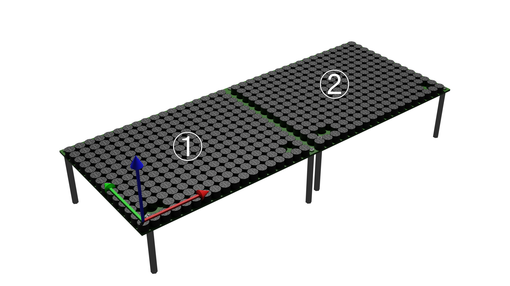
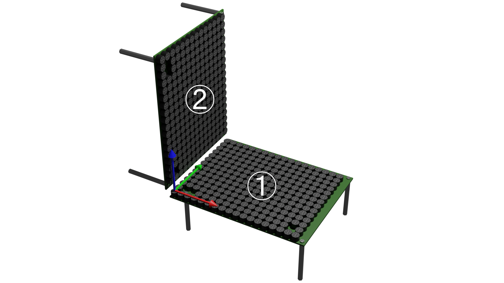

# Geometry

この章ではGeometryについて解説する.
GeometryはAUTD3デバイスが現実世界でどのように配置されているかを管理している.

[[_TOC_]]

## 複数デバイスの接続

AUTD3のデバイスは複数台をデイジーチェーンで接続できるようになっている.
SDKは複数台を接続したとしても, 透過的に使用できるように設計されている.

複数のデバイスを接続する場合は,
PCと1台目のEtherCAT Inをケーブルでつなぎ, $i$台目のEtherCAT Outと$i+1$台目のEtherCAT Inをケーブルで接続する ([Concept](concept.md)参照).

なお, 電源も相互に接続でき, 電源コネクタは3つの内で好きなところを使って良い.

> NOTE: AUTD3は最大でデバイスあたり$\SI{2}{A}$の電流を消費する. 電源の最大出力電流に注意されたい.

SDKで複数台のデバイスを使用する場合は`add_device`関数を**接続したデバイスの順に**呼び出す必要がある.

<figure>
  
</figure>

例えば, 上図のように配置・接続しており, 図左側のデバイスが1台目, 右側のデバイスが2台目だとする.
さらに, グローバル座標を1台目のローカル座標と同じようにとるとすると,

```rust,edition2021
{{#include ../../codes/Users_Manual/geometry_0.rs}}
```

```cpp
{{#include ../../codes/Users_Manual/geometry_0.cpp}}
```

```cs
{{#include ../../codes/Users_Manual/geometry_0.cs}}
```

```python
{{#include ../../codes/Users_Manual/geometry_0.py}}
```

とすれば良い.
ここで, `AUTD3`コンストラクタの第1引数は位置, 第2引数は回転を表す.
回転はZYZのオイラー角, または, クオータニオンで指定する.
また, `AUTD3::DEVICE_WIDTH`はデバイスの (基板外形を含めた) 横幅である.
この例では, 回転はしないので, 第2引数はゼロで良い.

<figure>
  
</figure>

また, 例えば上図のように, グローバル座標を2台目のローカル座標と同じようにとるとすると,

```rust,edition2021
{{#include ../../codes/Users_Manual/geometry_1.rs}}
```

```cpp
{{#include ../../codes/Users_Manual/geometry_1.cpp}}
```

```cs
{{#include ../../codes/Users_Manual/geometry_1.cs}}
```

```python
{{#include ../../codes/Users_Manual/geometry_1.py}}
```

とすれば良い.

<figure>
  
</figure>

さらに, 例えば, 上図のように配置されており, 下が1台目, 左が2台目で, グローバル座標を1台目のローカル座標と同じだとすると,

```rust,edition2021
{{#include ../../codes/Users_Manual/geometry_2.rs}}
```

```cpp
{{#include ../../codes/Users_Manual/geometry_2.cpp}}
```

```cs
{{#include ../../codes/Users_Manual/geometry_2.cs}}
```

```python
{{#include ../../codes/Users_Manual/geometry_2.py}}
```

のように指定する.

<figure>
  
</figure>

`add_device`を呼び出す順番は接続した順番に依存することに注意する.
例えば, 上図のように配置・接続しており, 図右側のデバイスが1台目, 左側のデバイスが2台目だとする.
この場合は, 右側のデバイスの座標を先に指定する必要がある.

SDKにおけるAPIでは, すべてグローバル座標を用いるため, 接続するデバイスの数に依存せず透過的に使用できる.

## デバイス/振動子のインデックス

デバイスには接続された順に0から始まるインデックスが割り当てられる.

また, 各デバイスは$249$個の振動子が配置されており, ローカルインデックスが割り振られている ([コンセプト](./concept.md)の「AUTDの表面写真」を参照).

## GeometryのAPI

- `num_devices`: デバイスの数を取得
- `num_transducers`: 全振動子の数を取得
- `center`: 全振動子の中心を取得

```rust,edition2021
{{#include ../../codes/Users_Manual/geometry_3.rs}}
```

```cpp
{{#include ../../codes/Users_Manual/geometry_3.cpp}}
```

```cs
{{#include ../../codes/Users_Manual/geometry_3.cs}}
```

```python
{{#include ../../codes/Users_Manual/geometry_3.py}}
```

### Deviceの取得

`Geometry`は`Device`のコンテナになっており, `Device`が`Transducer`のコンテナになっている.

`Device`を取得するには, インデクサを使用する.
あるいは, イテレータを使用することもできる.

```rust,edition2021
{{#include ../../codes/Users_Manual/geometry_4.rs}}
```

```cpp
{{#include ../../codes/Users_Manual/geometry_4.cpp}}
```

```cs
{{#include ../../codes/Users_Manual/geometry_4.cs}}
```

```python
{{#include ../../codes/Users_Manual/geometry_4.py}}
```

## DeviceのAPI

- `idx`: デバイスのインデックス
- `enable`: enableフラグ. オフにすると, 以降, そのデバイスのデータは更新されなくなる.
  - 更新されなくなるだけで, 出力が止まるわけではないことに注意.
- `sound_speed`: 音速の取得/設定. 単位はmm/s.
- `set_sound_speed_from_temp`: 温度から音速を設定. 温度の単位は摂氏である.デフォルトの音速は$340\times 10^{3}\,\mathrm{mm/s}$となっており, これは, およそ摂氏15度での空気の音速に相当する.なお, `Geometry`にも同名の関数があり, それを使用することですべてのデバイスに対して温度から音速を設定できる.
- `attenuation`: 減衰係数の取得/設定. 単位はNp/mm. デフォルトでは, $0$に設定されている.
- `translate`: 平行移動
- `rotate`: 回転
- `affine`: アフィン変換 (平行移動/回転)

```rust,edition2021
{{#include ../../codes/Users_Manual/device_0.rs}}
```

```cpp
{{#include ../../codes/Users_Manual/device_0.cpp}}
```

```cs
{{#include ../../codes/Users_Manual/device_0.cs}}
```

```python
{{#include ../../codes/Users_Manual/device_0.py}}
```

### Transducerの取得

`Device`は`Transducer`のコンテナになっており, `Transducer`は各振動子の情報を格納している.

`Transducer`を取得するには, インデクサを使用する.
また, イテレータを使用することもできる.

```rust,edition2021
{{#include ../../codes/Users_Manual/device_1.rs}}
```

```cpp
{{#include ../../codes/Users_Manual/device_1.cpp}}
```

```cs
{{#include ../../codes/Users_Manual/device_1.cs}}
```

```python
{{#include ../../codes/Users_Manual/device_1.py}}
```

## TransducerのAPI

以下の情報を取得できる.

- `idx`: 振動子の(ローカル)インデックス
- `position`: 振動子の位置
- `rotation`: 振動子の回転. 回転はクオータニオンで表される.
- `x_direction`: 振動子のx方向ベクトル
- `y_direction`: 振動子のy方向ベクトル
- `z_direction`: 振動子のz方向ベクトル
- `wavelength`: 振動子の波長. 引数に音速を渡す必要がある.
- `wavenumber`: 振動子の波数. 引数に音速を渡す必要がある.

```rust,edition2021
{{#include ../../codes/Users_Manual/transducer_0.rs}}
```

```cpp
{{#include ../../codes/Users_Manual/transducer_0.cpp}}
```

```cs
{{#include ../../codes/Users_Manual/transducer_0.cs}}
```

```python
{{#include ../../codes/Users_Manual/transducer_0.py}}
```

