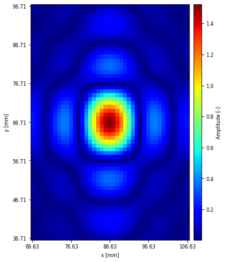

# Monitor

`Monitor`リンクはデバッグ用の`Link`である.

この`Link`は内部でpythonのmatplotlibライブラリを使用するので, 事前にmatplotlibをインストールする必要がある.

## 位相パターンの可視化

```rust
# use autd3::prelude::*;
use autd3_link_monitor::{Monitor, PlotConfig};

use std::path::Path;

# #[allow(unused_variables)]
# fn main() -> Result<(), Box<dyn std::error::Error>> {
let mut autd = Controller::builder()
    .add_device(AUTD3::new(Vector3::zeros(), Vector3::zeros()))
    .open_with(Monitor::new())?;

# autd.send(Clear::new())?;
# autd.send(Synchronize::new())?;
let center = autd.geometry().center() + Vector3::new(0., 0., 150.0 * MILLIMETER);
let g = Focus::new(center);
autd.send(g)?;

autd.link().plot_phase(
    PlotConfig {
        fname: Path::new("phase.png").into(),
        figsize: (6, 4),
        dpi: 72,
        ..PlotConfig::default()
    },
    autd.geometry(),
)?;
# autd.close()?;
# Ok(())
# }
```

<figure>
  
</figure>

## 変調データの可視化

```rust
# use autd3::prelude::*;
use autd3_link_monitor::{Monitor, PlotConfig};

use std::path::Path;

# #[allow(unused_variables)]
# fn main() -> Result<(), Box<dyn std::error::Error>> {
let mut autd = Controller::builder()
    .add_device(AUTD3::new(Vector3::zeros(), Vector3::zeros()))
    .open_with(Monitor::new())?;

# autd.send(Clear::new())?;
# autd.send(Synchronize::new())?;
let m = Sine::new(150);
autd.send(m)?;

autd.link().plot_modulation(
    PlotConfig {
        fname: Path::new("mod.png").into(),
        figsize: (6, 4),
        dpi: 72,
        ..PlotConfig::default()
    },
)?;
# autd.close()?;
# Ok(())
# }
```

<figure>
  
</figure>

## 音場の可視化

```rust
# use autd3::prelude::*;
use autd3_link_monitor::*;

use std::path::Path;

# #[allow(unused_variables)]
# fn main() -> Result<(), Box<dyn std::error::Error>> {
let mut autd = Controller::builder()
    .add_device(AUTD3::new(Vector3::zeros(), Vector3::zeros()))
    .open_with(Monitor::new())?;

# autd.send(Clear::new())?;
# autd.send(Synchronize::new())?;
let center = autd.geometry().center() + Vector3::new(0., 0., 150.0 * MILLIMETER);

autd.send(Focus::new(center))?;

autd.link().plot_field(
    PlotRange{ 
        x_range: center.x - 20.0..center.x + 20.0,
        y_range: center.y - 30.0..center.y + 30.0,
        z_range: center.z..center.z,
        resolution: 1.
    },
    PlotConfig {
        fname: Path::new("xy.png").into(),
        figsize: (6, 6),
        dpi: 72,
        fontsize: 8,
        ..PlotConfig::default()
    },
    autd.geometry(),
)?;
# autd.close()?;
# Ok(())
# }
```

<figure>
  
</figure>

### 音場計算

`calc_filed`関数で, プロットせずに音場の計算を行うことができる.

```rust
# use autd3::prelude::*;
use autd3_link_monitor::Monitor;

use std::path::Path;

# #[allow(unused_variables)]
# fn main() -> Result<(), Box<dyn std::error::Error>> {
let mut autd = Controller::builder()
    .add_device(AUTD3::new(Vector3::zeros(), Vector3::zeros()))
    .open_with(Monitor::new())?;

# autd.send(Clear::new())?;
# autd.send(Synchronize::new())?;
let center = autd.geometry().center() + Vector3::new(0., 0., 150.0 * MILLIMETER);

autd.send(Focus::new(center))?;

let p = autd.link().calc_field([center], autd.geometry());
println!(
    "Acoustic pressure at ({}, {}, {}) = {}",
    center.x, center.y, center.z, p[0]
);

# autd.close()?;
# Ok(())
# }
```

第1引数に, 音場を計算する位置のイテレータを指定する.
返り値は, 指定した点における複素音圧の`Vec`である.

## GPUの有効化

`gpu` featureを有効化することで, 音場の計算をGPU行うことができるようになる.

```shell
cargo add autd3-link-monitor --features gpu
```

```rust,ignore
# use autd3::prelude::*;
# use autd3_link_monitor::{Monitor, PlotConfig};

# #[allow(unused_variables)]
# fn main() -> Result<(), Box<dyn std::error::Error>> {
# let mut autd = Controller::builder()
#     .add_device(AUTD3::new(Vector3::zeros(), Vector3::zeros()))
#     .open_with(
Monitor::new().with_gpu(-1)
# )?;
# autd.close()?;
# Ok(())
# }
```

`with_gpu`の引数にはGPUのIDを指定する. `-1`を指定すると, 適当なGPUが自動的に選択される.
