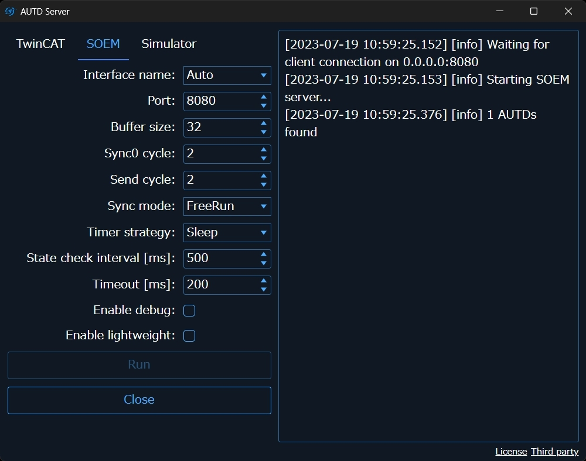

[[_TOC_]]

# SOEM

[SOEM](https://github.com/OpenEtherCATsociety/SOEM)は有志が開発しているオープンソースのEherCAT Masterライブラリである.
TwinCATとは異なり通常のWindows上で動作するためリアルタイム性は保証されない.
そのため, 基本的にTwinCATを使用することを推奨する.
SOEMを使用するのはやむを得ない理由があるか, 開発時のみに限定するべきである.
一方, SOEMはクロスプラットフォームで動作し, インストールも単純という利点がある.

Windowsの場合は, [npcap](https://nmap.org/npcap/)を**WinPcap API compatible mode**でインストールしておくこと.
Linux/macOSの場合は, 特に準備は必要ない.

> NOTE: `SOEM`を使用する場合, `Controller`をopenしてから10-20秒ほどはEtherCATスレーブ同士の同期が完了していない可能性があるので注意されたい. (この時間は個体差や同期信号/送信サイクルによって変化する.)
> この期間, デバイス間の超音波の同期は保証されない.

## SOEMリンクのAPI

### インタフェース名

`with_ifname`でAUTD3デバイスが接続されているネットワークインタフェースを指定できる.

```rust,should_panic,edition2021
# extern crate autd3;
# extern crate autd3_link_soem;
# use autd3::prelude::*;
use autd3_link_soem::SOEM;

# #[allow(unused_variables)]
# fn main() -> Result<(), Box<dyn std::error::Error>> {
# let autd = Controller::builder()
#     .add_device(AUTD3::new(Vector3::zeros(), Vector3::zeros()))
#     .add_device(AUTD3::new(Vector3::new(0., 0., DEVICE_WIDTH), Vector3::new(0., PI/2.0, 0.)))
#            .open_with(
SOEM::new()
    .with_ifname("")
# )?;
# Ok(())
# }
```

```cpp
#include "autd3/link/soem.hpp"

autd3::link::SOEM()
	.with_ifname("")
```

```cs
new SOEM()
    .WithIfname("")
```

```python
from pyautd3.link import SOEM

SOEM()\
    .with_ifname("")
```

デフォルトでは空白であり, 空白の場合はAUTD3デバイスが接続されているネットワークインタフェースを自動的に選択する.

### リンク切断時のコールバック

`with_on_lost`関数で, 回復不能なエラー (例えば, ケーブルが抜けるなど) が発生したときのコールバックを設定できる[^fn_soem_err].
コールバック関数はエラーメッセージを引数に取る.

```rust,should_panic,edition2021
# extern crate autd3;
# extern crate autd3_link_soem;
# use autd3::prelude::*;
use autd3_link_soem::SOEM;

# #[allow(unused_variables)]
# fn main() -> Result<(), Box<dyn std::error::Error>> {
# let autd = Controller::builder()
#     .add_device(AUTD3::new(Vector3::zeros(), Vector3::zeros()))
#     .add_device(AUTD3::new(Vector3::new(0., 0., DEVICE_WIDTH), Vector3::new(0., PI/2.0, 0.)))
#            .open_with(
SOEM::new()
    .with_on_lost(|msg| {
            eprintln!("Unrecoverable error occurred: {msg}");
            std::process::exit(-1);
        })
# )?;
# Ok(())
# }
```

```cpp
#include "autd3/link/soem.hpp"

void on_lost(const char* msg) {
  std::cerr << "Link is lost\n";
  std::cerr << msg;
  exit(-1);
}

autd3::link::SOEM()
    .with_on_lost(&on_lost)
```

```cs
var onLost = new SOEM.OnLostCallbackDelegate((string msg) =>
{
    Console.WriteLine($"Unrecoverable error occurred: {msg}");
    Environment.Exit(-1);
});

new SOEM()
    .WithOnLost(onLost)
```

```python
from pyautd3.link import SOEM, OnLostFunc

def on_lost(msg: ctypes.c_char_p):
    print(msg.decode("utf-8"), end="")
    os._exit(-1)

on_lost_func = OnLostFunc(on_lost)

SOEM()\
    .with_on_lost(on_lost_func)
```

### 同期信号/送信サイクル

`SOEM`も大量のデバイスを接続すると挙動が不安定になる場合がある[^fn_soem].
このときは, `with_sync0_cycle`と`with_send_cycle`関数を使用し, その値を増やす.


```rust,should_panic,edition2021
# extern crate autd3;
# extern crate autd3_link_soem;
# use autd3::prelude::*;
use autd3_link_soem::SOEM;

# #[allow(unused_variables)]
# fn main() -> Result<(), Box<dyn std::error::Error>> {
# let autd = Controller::builder()
#     .add_device(AUTD3::new(Vector3::zeros(), Vector3::zeros()))
#     .add_device(AUTD3::new(Vector3::new(0., 0., DEVICE_WIDTH), Vector3::new(0., PI/2.0, 0.)))
#            .open_with(
SOEM::new()
    .with_sync0_cycle(2)
    .with_send_cycle(2)
# )?;
# Ok(())
# }
```

```cpp
#include "autd3/link/soem.hpp"

autd3::link::SOEM()
    .with_sync0_cycle(2)
    .with_send_cycle(2)
```

```cs
new SOEM()
    .WithSync0Cycle(2)
    .WithSendCycle(2)
```

```python
from pyautd3.link import SOEM

SOEM()\
    .with_sync0_cycle(2)\
    .with_send_cycle(2)
```

この値はエラーが出ない中で, 可能な限り小さな値が望ましい. デフォルトは2であり, どの程度の値にすべきかは接続している台数に依存する.
例えば, 9台の場合は3, 4程度の値にしておけば動作するはずである.

### Timer strategy

EtherCATは、一定の間隔で周期的にフレームを送信することで動作する.
`with_timer_strategy`でこの周期的な送信をどのように行うかを指定できる.

```rust,should_panic,edition2021
# extern crate autd3;
# extern crate autd3_link_soem;
# use autd3::prelude::*;
use autd3_link_soem::SOEM;

# #[allow(unused_variables)]
# fn main() -> Result<(), Box<dyn std::error::Error>> {
# let autd = Controller::builder()
#     .add_device(AUTD3::new(Vector3::zeros(), Vector3::zeros()))
#     .add_device(AUTD3::new(Vector3::new(0., 0., DEVICE_WIDTH), Vector3::new(0., PI/2.0, 0.)))
#            .open_with(
SOEM::new()
    .with_timer_strategy(TimerStrategy::BusyWait)
# )?;
# Ok(())
# }
```

```cpp
#include "autd3/link/soem.hpp"

autd3::link::SOEM()
    .with_timer_strategy(autd3::TimerStrategy::BusyWait)
```

```cs
new SOEM()
    .WithTimerStrategy(TimerStrategy.BusyWait)
```

```python
from pyautd3 import TimerStrategy
from pyautd3.link import SOEM

SOEM()\
    .with_timer_strategy(TimerStrategy.BusyWait)
```

* `Sleep`       : 標準ライブラリのsleepを用いる
* `BusyWait`    : ビジーウェイトを用いる. 高解像度だが, CPU負荷が高い.
* `NativeTimer` : OSのタイマー機能を用いる
  * Windowsではマルチメディアタイマー, linuxではPOSIXタイマー, macOSではGrand Central Dispatch Timer

デフォルトは`Sleep`である.

### 同期モード

`with_sync_mode`でEtherCATの同期モードを設定する.
同期モードには, `DC`と`FreeRun`が存在する.

* 詳細は[Beckhoffの説明](https://infosys.beckhoff.com/english.php?content=../content/1033/ethercatsystem/2469122443.html&id=)を参照されたい.


```rust,should_panic,edition2021
# extern crate autd3;
# extern crate autd3_link_soem;
# use autd3::prelude::*;
use autd3_link_soem::{SOEM, SyncMode};

# #[allow(unused_variables)]
# fn main() -> Result<(), Box<dyn std::error::Error>> {
# let autd = Controller::builder()
#     .add_device(AUTD3::new(Vector3::zeros(), Vector3::zeros()))
#     .add_device(AUTD3::new(Vector3::new(0., 0., DEVICE_WIDTH), Vector3::new(0., PI/2.0, 0.)))
#            .open_with(
SOEM::new()
    .with_sync_mode(SyncMode::DC)
# )?;
# Ok(())
# }
```

```cpp
#include "autd3/link/soem.hpp"

autd3::link::SOEM()
    .with_sync_mode(autd3::link::SyncMode::DC)
```

```cs
new SOEM()
    .WithSyncMode(SyncMode.Dc)
```

```python
from pyautd3.link import SOEM, SyncMode

SOEM()\
    .with_sync_mode(SyncMode.DC)
```

デフォルトは`FreeRun`である.

# RemoteSOEM

このLinkは`SOEM`を動かすサーバーPCとユーザプログラムを動かすクライアントPCを分離するためのものである.

`RemoteSOEM`を使用する場合はPCを2台用意する必要がある.
この時, 片方のPCは`SOEM` linkが使えるである必要がある.
このPCをここでは"サーバ"と呼ぶ.
一方, 開発側のPC, 即ちSDKを使用する側は特に制約はなく, サーバと同じLANに繋がっていれば良い, こちらをここでは"クライアント"と呼ぶ.

まず, サーバとAUTDデバイスを接続する.
また, サーバとクライアントを別のLANで繋ぐ[^fn_remote_soem].
そして, サーバとクライアント間のLANのIPを確認しておく.
ここでは例えば, サーバ側が`172.16.99.104`, クライアント側が`172.16.99.62`だったとする.

## AUTD Server

`RemoteSOEM`を使用する場合, サーバに`AUTD Server`をインストールする必要がある.
[GitHub Releases](https://github.com/shinolab/autd3/releases)にてインストーラを配布しているので, これをダウンロードし, 指示に従ってインストールする.

`AUTD Server`を実行すると, 以下のような画面になるので, `SOEM`タブを開く.

<figure>
  
</figure>

ポートに適当なポート番号を指定し, `Run`ボタンを押す.

AUTD3デバイスが見つかり, クライアントとの接続待ちである旨のメッセージが表示されれば成功である.

なお, `AUTD Server`では`SOEM`と同等のオプションを指定できる.

## RemoteSOEMリンクのAPI

`RemoteSOEM`のコンストラクタでは, <サーバのIP:ポート>を指定する.

```rust,should_panic,edition2021
# extern crate autd3;
# extern crate autd3_link_soem;
# use autd3::prelude::*;
use autd3_link_soem::RemoteSOEM;

# #[allow(unused_variables)]
# fn main() -> Result<(), Box<dyn std::error::Error>> {
# let autd = Controller::builder()
#     .add_device(AUTD3::new(Vector3::zeros(), Vector3::zeros()))
#     .add_device(AUTD3::new(Vector3::new(0., 0., DEVICE_WIDTH), Vector3::new(0., PI/2.0, 0.)))
#            .open_with(
RemoteSOEM::new("172.16.99.104:8080".parse()?)?
# )?;
# Ok(())
# }
```

```cpp
#include "autd3/link/soem.hpp"

autd3::link::RemoteSOEM("172.16.99.104:8080")
```

```cs
new RemoteSOEM(new IPEndPoint(IPAddress.Parse("172.16.99.104"), 8080))
```

```python
from pyautd3.link import RemoteSOEM

RemoteSOEM("172.16.99.104:8080")
```

## ファイアウォール

TCP関係のエラーが出る場合は, ファイアウォールでブロックされている可能性がある.
その場合は, ファイアウォールの設定でTCP/UDPの指定したポートの接続を許可する.

[^fn_soem_err]: なお, 回復不能なので直ちに終了するくらいしかできることはない.

[^fn_soem]: TwinCATよりは緩く, 普通に動くこともある.

[^fn_remote_soem]: 無線LANでも可
