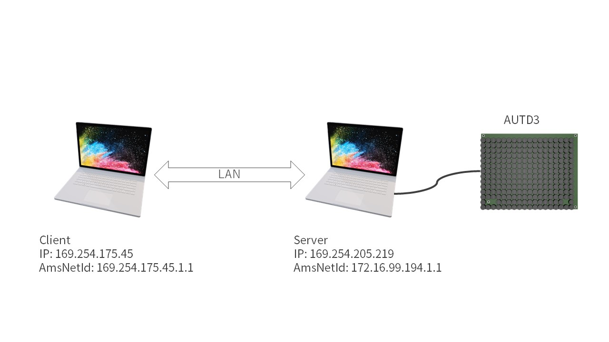
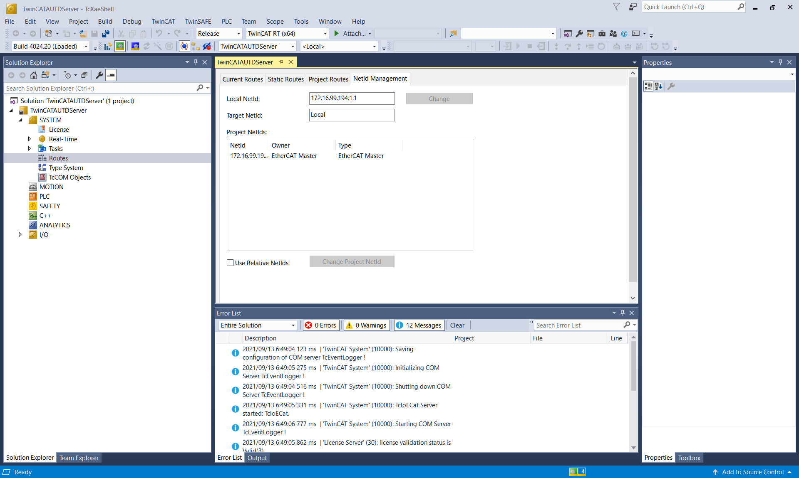

[[_TOC_]]

# TwinCAT

TwinCATはPCでEherCATを使用する際の唯一の公式の方法である.
TwinCATはWindowsのみをサポートする非常に特殊なソフトウェアであり, Windowsを半ば強引にリアルタイム化する.

また, 特定のネットワークコントローラが求められるため,
[対応するネットワークコントローラの一覧](https://infosys.beckhoff.com/english.php?content=../content/1033/tc3_overview/9309844363.html&id=)を確認すること.

> Note: 或いは, TwinCATのインストール後に, `C:/TwinCAT/3.1/Driver/System/TcI8254x.inf`に対応するデバイスのVendor IDとDevice IDが書かれているので,「デバイスマネージャー」→「イーサネットアダプタ」→「プロパティ」→「詳細」→「ハードウェアID」と照らし合わせることでも確認できる.

上記以外のネットワークコントローラでも動作する場合があるが, その場合, 正常な動作とリアルタイム性は保証されない.

## TwinCATのインストール

前提として, TwinCATはHyper-VやVirtual Machine Platformと共存できない.
そのため, これらの機能を無効にする必要がある.
これには, 例えば, PowerShellを管理者権限で起動し,

```PowerShell
Disable-WindowsOptionalFeature -Online -FeatureName Microsoft-Hyper-V-Hypervisor
Disable-WindowsOptionalFeature -Online -FeatureName VirtualMachinePlatform
```

と打ち込めば良い.

まず, TwinCAT XAEを[公式サイト](https://www.beckhoff.com/en-en/)からダウンロードする.
ダウンロードには登録 (無料) が必要になる.

ダウンロードしたインストーラを起動し, 指示に従う.
**この時, TwinCAT XAE Shell installにチェックを入れ, Visual Studio Integrationのチェックを外すこと.**

インストール後に再起動し, `C:/TwinCAT/3.1/System/win8settick.bat`を管理者権限で実行し, 再び再起動する.

最後に, SDK内の`dist/TwinCATAUTDServer/AUTD.xml`を`C:/TwinCAT/3.1/Config/Io/EtherCAT`にコピーする.

## TwinCATAUTDServer

TwinCATのLinkを使うには, まず, `dist/TwinCATAUTDServer/TwinCATAUTDServer.exe`を実行する.

初回のみ, ドライバをインストールするために, `-k`オプションを付けて, TwinCAT XAE Shellを開いたままにしておくこと.

```shell
TwinCATAUTDServer.exe -k
```

> Note: もし閉じてしまった場合は, `%TEMP%/TwinCATAUTDServer/TwinCATAUTDServer.sln`をTcXaeShell Applicationとして開けば良い. `%TEMP%`は環境変数で, 普通は`C:/Users/(user name)/AppData/Local/Temp`である.

なお, TwinCATAUTDServerはPCの電源を切る, スリープモードに入る等でLinkが途切れるので, その都度実行し直すこと.

### ドライバのインストール

初回はEherCAT用のドライバのインストールが必要になる.
TwinCAT XAE Shell上部メニューから「TwinCAT」→「Show Realtime Ethernet Compatible Devices」を開き「Compatible devices」の中の対応デバイスを選択し, Installをクリックする.
「Installed and ready to use devices (realtime capable)」にインストールされたアダプタが表示されていれば成功である.

なお,「Compatible devices」に何も表示されていない場合はそのPCのイーサネットデバイスはTwinCATに対応していない.
「Incompatible devices」の中のドライバもインストール自体は可能で, インストールすると「Installed and ready to use devices (for demo use only)」と表示される.
この場合, 使用できるが動作保証はない.

### ライセンス

また, 初回はライセンス関係のエラーが出るので, XAE Shellで「Solution Explorer」→「SYSTEM」→「License」を開き, 「7 Days Trial License ...」をクリックし, 画面に表示される文字を入力する.
なお. ライセンスは7日間限定のトライアルライセンスだが, 切れたら再び同じ作業を行うことで再発行できる.
ライセンスを発行し終わったら, TwinCAT XAE Shellを閉じて, 再び`TwinCATAUTDServer.exe`を実行する.

## TwinCATリンクのAPI

### コンストラクタ

```rust,should_panic
# use autd3::prelude::*;
use autd3_link_twincat::TwinCAT;

# #[allow(unused_variables)]
# fn main() -> Result<(), Box<dyn std::error::Error>> {
# let autd = Controller::builder()
#     .add_device(AUTD3::new(Vector3::zeros(), Vector3::zeros()))
#     .add_device(AUTD3::new(Vector3::new(0., 0., DEVICE_WIDTH), Vector3::new(0., PI/2.0, 0.)))
#     .open_with(
TwinCAT::new()?
# )?;
# Ok(())
# }
```

```cpp
#include "autd3/link/twincat.hpp"

autd3::link::TwinCAT();
```

```cs
new TwinCAT();
```

```python
from pyautd3.link import TwinCAT

TwinCAT()
```

## トラブルシューティング

大量のデバイスを使用しようとすると, 下の図のようなエラーが発生することがある.

<figure>
  
  <figcaption>9台のAUTD3デバイスを使用した際のTwinCATエラー</figcaption>
</figure>

この場合は, `TwinCATAUTDServer`のオプションの`-s`と`-t`の値を増やし, TwinCATAUTDServerを再び実行する.
これらのオプションの値はデフォルトでそれぞれ`2`になっている.

```shell
TwinCATAUTDServer.exe -s 3 -t 3
```

どの程度の値にすればいいかは接続する台数による.
エラーが出ない中で可能な限り小さな値が望ましい.
例えば, 9台の場合は3, 4程度の値にしておけば動作するはずである.

# RemoteTwinCAT

前述の通り, AUTD3とTwinCATを使う場合はWindows OSと特定のネットワークアダプタが必要になる.
Windows以外のPCで開発したい場合は, RemoteTwinCAT linkを用いてLinux/macOSから遠隔でTwinCATを操作することができる.

## セットアップ

RemoteTwinCATを使用する場合はPCを2台用意する必要がある.
この時, 片方のPCは上記のTwinCAT linkが使えるである必要がある.
このPCをここでは"サーバ"と呼ぶ.
一方, 開発側のPC, 即ちSDKを使用する側は特に制約はなく, サーバと同じLANに繋がっていれば良い, こちらをここでは"クライアント"と呼ぶ.

<figure>
  
  <figcaption>Network Configuration</figcaption>
</figure>

まず, サーバとAUTDデバイスを接続する.
この時使うLANのアダプタはTwinCAT linkと同じく, TwinCAT対応のアダプタである必要がある.
また, サーバとクライアントを別のLANで繋ぐ.
こちらのLANアダプタはTwinCAT対応である必要はない[^fn_remote_twin].
そして, サーバとクライアント間のLANのIPを確認しておく.
ここでは例えば, サーバ側が"169.254.205.219", クライアント側が"169.254.175.45"だったとする.
次に, サーバでTwinCATAUTDServerを起動する.
この時, `-c`オプションでクライアントのIPアドレス (この例だと`169.254.175.45`) を指定する.
また, 最後に`-k`オプションを使用し, TwinCATAUTDServerを開いたままにしておく.

```ignore
TwinCATAUTDServer.exe -c 169.254.175.45 -k
```

そして, 以下の図のように, System→Routesを開き, NetId ManagementタブのLocal NetIdを確認しておく.

<figure>
  
  <figcaption>Server AmsNetId</figcaption>
</figure>

ここでは, "172.16.99.194.1.1"だったとする.

また, クライアントのAMS NetIdを確認しておく.
これは, 以下の図のようにTwinCATで「System」→「Routes」を開き, 「Current Route」タブのAmsNetIdで確認できる.

<figure>
  
  <figcaption>Client AmsNetId</figcaption>
</figure>

## RemoteTwinCATリンクのAPI

### コンストラクタ

RemoteTwinCATリンクのコンストラクタにはサーバのNetIdを指定する.

また, `with_server_ip`と`with_client_ams_net_id`でサーバーのIPアドレスとクライアントのNetIdを指定する.
これらは省略することも可能だが, 基本的には指定することを推奨する.

```rust,should_panic
# use autd3::prelude::*;
use autd3_link_twincat::RemoteTwinCAT;

# #[allow(unused_variables)]
# fn main() -> Result<(), Box<dyn std::error::Error>> {
# let autd = Controller::builder()
#     .add_device(AUTD3::new(Vector3::zeros(), Vector3::zeros()))
#     .add_device(AUTD3::new(Vector3::new(0., 0., DEVICE_WIDTH), Vector3::new(0., PI/2.0, 0.)))
#      .open_with(
RemoteTwinCAT::new("172.16.99.194.1.1")?
            .with_server_ip("169.254.205.219")
            .with_client_ams_net_id("169.254.175.45.1.1")
# )?;
# Ok(())
# }
```

```cpp
#include "autd3/link/twincat.hpp"

autd3::link::RemoteTwinCAT("172.16.99.194.1.1")
				.with_server_ip("169.254.205.219")
				.with_client_ams_net_id("169.254.175.45.1.1");
```

```cs
new RemoteTwinCAT("172.16.99.194.1.1")
        .WithServerIp(IPAddress.Parse("169.254.205.219"))
        .WithClientAmsNetId("169.254.175.45.1.1");
```

```python
from pyautd3.link import RemoteTwinCAT

RemoteTwinCAT("172.16.99.194.1.1")\
    .with_server_ip("169.254.205.219")\
    .with_client_ams_net_id("169.254.175.45.1.1")
```

## ファイアウォール

TCP関係のエラーが出る場合は, ファイアウォールでADSプロトコルがブロックされている可能性がある.
その場合は, ファイアウォールの設定でTCP/UDPの48898番ポートの接続を許可する.

[^fn_remote_twin]: 無線LANでも可
