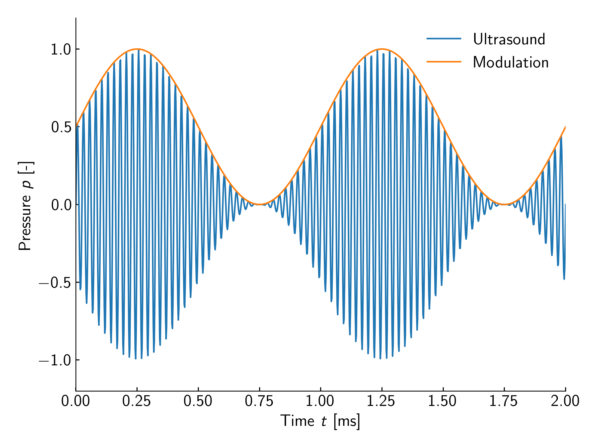

# Modulation

`Modulation`はAM変調を制御するための仕組みである.

Modulationは音圧振幅に掛け合わされる.
例えば, $\SI{1}{kHz}$の`Sine`変調を印加した場合の音圧振幅は以下のようになり, 音圧振幅の正の部分 (或いは, 負の部分) の包絡線が$\SI{1}{kHz}$のsin波に従う.

<figure>
  
</figure>

なお, 現在, `Modulation`には以下の制約がある.

* バッファサイズは最大で65536
* Modulationデータは内部で8-bit符号なし整数に変換され, 超音波PWM信号のDuty比と掛け合わされる
* サンプリングレートは$\clkf/N$で, $N$は32-bit符号なし整数であり, $512$以上の値である必要がある
* Modulationは自動でループする. 1ループだけ, 等の制御は不可能
* Modulationの開始/終了タイミングは制御できない

SDKにはデフォルトでいくつかの種類のAMを生成するための`Modulation`が用意されている.

* [Static](./modulation/static.md)
* [Sine](./modulation/sine.md)
  * [Fourier](./modulation/fourier.md)
* [Square](./modulation/square.md)
* [Wav](./modulation/wav.md)
* [RawPCM](./modulation/rawpcm.md)
* [Cache](./modulation/cache.md)
* [RadiationPressure](./modulation/radiation.md)
* [Transform](./modulation/transform.md)

## Modulationの共通API

### Sampling設定

`sampling_config`でサンプリング設定を取得できる.
デフォルトのサンプリング周波数は$\SI{4}{kHz}$である.

また, 一部の`Modulation`は`with_sampling_config`でサンプリングを設定できる.
ただし, `Modulation`の制約上, 必ずしも指定した設定になるとは限らない.

```rust,edition2021
{{#include ../../codes/Users_Manual/modulation_0.rs}}
```

```cpp
{{#include ../../codes/Users_Manual/modulation_0.cpp}}
```

```cs
{{#include ../../codes/Users_Manual/modulation_0.cs}}
```

```python
{{#include ../../codes/Users_Manual/modulation_0.py}}
```

### 変調データサイズ

変調データサイズは以下のように取得する.

```rust,edition2021
{{#include ../../codes/Users_Manual/modulation_1.rs}}
```

```cpp
{{#include ../../codes/Users_Manual/modulation_1.cpp}}
```

```cs
{{#include ../../codes/Users_Manual/modulation_1.cs}}
```

```python
{{#include ../../codes/Users_Manual/modulation_1.py}}
```


## Modulation Delay

Modulationはすべての振動子に同時に作用し, 伝搬遅延を考慮しない.
そのため, 振動子と焦点位置との間の距離に応じて, 変調がずれる可能性がある.

これを補償するために, 振動子毎にサンプリングするインデックスを遅らせる機能が備わっている.

例えば, 以下のようにすると, $0$番目のデバイスの$0$番目の振動子は他のすべての振動子に対して, サンプリングするインデックスが一つ遅れる.

```rust,edition2021
{{#include ../../codes/Users_Manual/modulation_2.rs}}
```

```cpp
{{#include ../../codes/Users_Manual/modulation_2.cpp}}
```

```cs
{{#include ../../codes/Users_Manual/modulation_2.cs}}
```

```python
{{#include ../../codes/Users_Manual/modulation_2.py}}
```

サンプリングされるインデックスに対する遅れであるため, どの程度遅れるかは`Modulation`のサンプリング周波数に依存する.
`mod_delay`が$1$でサンプリング周波数が$\SI{40}{kHz}$の場合は$\SI{25}{\text{μ}s}$, $\SI{4}{kHz}$の場合は$\SI{250}{\text{μ}s}$の遅れになる.
