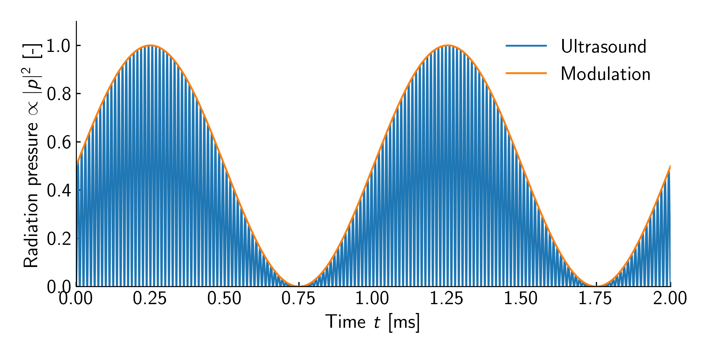

# RadiationPressure

`RadiationPressure`は`Modulation`を音圧ではなく, 放射圧 (音圧の二乗に比例) に印加するための`Modulation`である.

例えば, $\SI{1}{kHz}$の`Sine`変調に`RadiationPressure`を適用した場合の音圧振幅の放射圧は以下のようになり, 放射圧の包絡線が$\SI{1}{kHz}$のsin波に従う.

<figure>
  
</figure>

```rust,edition2021
{{#include ../../../codes/Users_Manual/modulation/radiation_0.rs}}
```

```cpp
{{#include ../../../codes/Users_Manual/modulation/radiation_0.cpp}}
```

```cs
{{#include ../../../codes/Users_Manual/modulation/radiation_0.cs}}
```

```python
{{#include ../../../codes/Users_Manual/modulation/radiation_0.py}}
```
