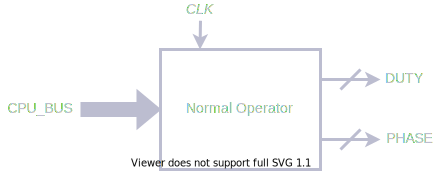

# Normal operator

Normal Operator回路のダイアグラムは以下の通りである.

<figure>

<figcaption>Normal Operator Diagram</figcaption>
</figure>

| In/Out | 名前         | バス幅         | 説明                             |
| :----- | :----------- | :------------- | :------------------------------- |
|   In   | CLK          | $1$            | クロック ($20.48\,\mathrm{MHz}$) |
|   In   | CPU_BUS      | -              | CPUバス                          |
|   Out  | DUTY         | $13\times 249$ | Duty比$D$                        |
|   Out  | PHASE        | $13\times 249$ | 位相$P$                          |

Normal OperatorはBRAMに書き込まれたDuty比と位相データをそのまま出力する.
