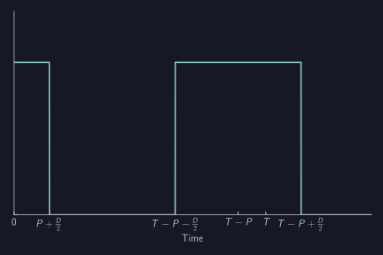
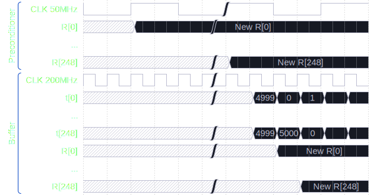

# PWM

PWM信号を生成する回路のダイアグラムは以下の通りである.

<figure>

<figcaption>PWM Diagram</figcaption>
</figure>

| In/Out | 名前         | バス幅         | 説明                              |
| :----- | :----------- | :------------- | :-------------------------------- |
|   In   | CLK          | $1$            | クロック ($163.84\,\mathrm{MHz}$) |
|   In   | CLK_L        | $1$            | クロック ($20.48\,\mathrm{MHz}$)  |
|   In   | SYS_TIME     | $64$           | 同期時刻                          |
|   In   | CYCLE        | $13\times 249$ | 周期$T$                           |
|   In   | SET          | $1$            | 周期$T$セット信号                 |
|   In   | DUTY         | $13\times 249$ | PWMのDuty比$D$                    |
|   In   | PHASE        | $13\times 249$ | PWMの位相$P$                      |
|   Out  | PWM_OUT      | $1\times 249$  | PWMの出力$v$                      |
|   Out  | DONE         | $1$            | データ更新完了通知 (Debug用)      |
|   Out  | TIME_CNT     | $13\times 249$ | 各振動子の時刻$t$ (Debug用)       |

### Time Count Generator

Time Count Generatorは, 各振動子の周期$T$に対して, それぞれの離散時刻$t$を生成する.
ここで, $t$は以下の式で計算される.
$$
t = \text{SYS\_TIME} \bmod T.
$$
したがって, $t$は$0$から$T - 1$までの値を繰り返す.
SYS_TIMEはあるデバイス内の全振動子で共通であり, 且つ, 全デバイス間で同期しているため, $t$も必然的に全てのデバイスの全振動子で同期する.

ただし, 実際の実装では, すべての振動子で並列に剰余を計算するリソースはないため, 剰余の計算は並行に行われる.
そして, あるクロックの立ち上がりのタイミングでは, 剰余計算される振動子以外の時刻はただ単にインクリメントされる.
SYS_TIMEによる同期は
$$
\frac{1}{163.84\,\mathrm{MHz}} \times 249 \sim 1.52\,\text{μs}, 
$$
の間隔で行われる.
AUTD3デバイスに使用されている水晶振動子 ([SG-8002CE-25.6M-PCB-L2, EPSON](https://www5.epsondevice.com/ja/products/crystal_oscillator/sg8002ce.html)) のトレランスは$\pm 50\,\mathrm{ppm}$であるため, 同期していない$1.52\,\text{μs}$間におけるズレは$\pm 0.076\,\mathrm{ns}$であり, 無視することができる.

なお, Bufferでの更新が確実に行われることを保証するため, 現在時刻$t$が$t=T-2$, かつ, 同期時刻が$0$となる場合は同期は行わず, インクリメントすることにしている.

> Note: あまりよろしくはないが, これが発生する確率は低いため放置している. そのうち修正する予定.

### Preconditioner

Preconditionerは, PWMのDuty比$D$, および, 位相$P$からPWM信号の立ち上がり時刻$R=T-P-\frac{D}{2}$と立ち下がり時刻$F=T-P+\frac{D}{2}$を計算する.
これは, PWM出力の計算を簡単にし, 使用ロジックを削減するためである.

> Note: 予め$R, F$を指定しないのは, Duty比と位相が非対称である可能性があるからである.

なお, $R, F$が$\lbrack0, T-1\rbrack$の範囲外の場合は, $\lbrack0, T-1\rbrack$の範囲に収まるように修正する.

<figure>
<figcaption>$R < 0$</figcaption>
</figure>
<figure>
<figcaption>$T < F$</figcaption>
</figure>

Preconditionerの計算は, $20.48\,\mathrm{MHz}$のクロックで, 振動子に対して並行に行われる.
計算のレイテンシは9クロックなので, Preconditionerの出力は
$$
  \frac{1}{20.48\,\mathrm{MHz}} \times (249 + 9) = 12.6\,\text{μs}
$$
間隔で更新される.

### Buffer

Preconditionerの計算は並行に行われるため, $R, F$の値も並行に更新される.
Bufferの役割は, これらの更新タイミングを各振動子の周期に合わせることである.

Bufferによる更新は, 各$t$が$t=T-1$のタイミングで行われる.

<figure>

<figcaption>すべての振動子が$T=5000$の場合のタイミング図</figcaption>
</figure>

<figure>

<figcaption>$T_0=5000, T_{248}=5001$の場合のタイミング図</figcaption>
</figure>

### Generator

GeneratorはTime Count Generatorから生成された$t$とBufferから出力された$R, F$を用いて, PWMの出力$v$を計算する.

$$
v = \begin{cases}
        (R \le t) \land (t < F) &\text{if } R \le F \\
        (t < F) \lor (R \le t)  &\text{Otherwise}  
      \end{cases}
$$
