# Synchronizer

Synchronizer回路のダイアグラムは以下の通りである.

<figure>

<figcaption>Synchronizer Diagram</figcaption>
</figure>

| In/Out | 名前                  | バス幅         | 説明                                  |
| :----- | :-----------          | :------------- | :--------------------------------     |
|   In   | CLK                   | $1$            | クロック ($163.84\,\mathrm{MHz}$)     |
|   In   | ECAT_SYNC_TIME        | $64$           | 同期開始時刻. 単位は$\SI{1}{ns}$      |
|   In   | SET                   | $1$            | 同期開始フラグ                        |
|   In   | ECAT_SYNC             | $1$            | 同期信号                              |
|   Out  | SYS_TIME              | $64$           | 同期時刻                              |

SynchronizerはすべてのFPGAで同期した時刻SYS_TIMEを生成するモジュールである.

ECAT_SYNCが立ち上がる前に, ECAT_SYNC_TIMEにECAT_SYNCが立ち上がる時刻 (EtherCAT時間) を書き込み, SETを立ち上げることで初期化する.

以降, SYS_TIMEはCLKによりインクリメントされていくが, CLKを生成する水晶振動子ごとずれを, ECAT_SYNC信号が立ち上がるたびに補正される.
なお, SYS_TIMEは逆戻りすることはない. SYS_TIMEが進んでいる場合はインクリメントを止め, SYS_TIMEが遅れている場合は余分にインクリメントされる.
