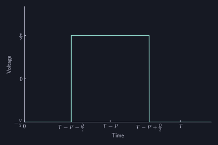

# PWM

AUTD3では, 振動子から送出される超音波の位相と振幅はPWMにより制御される.
Softwareから指定できるのは, PWMのDuty比$D$と位相$P$ (AUTD3ではこれらをPWMの*Gain*と呼ぶ), 及び, 周期$T$である.

## PWMパラメータと超音波出力の関係

PWMのGain及び周期$T$と超音波の出力の関係を考える.
AUTD3では, 原点に置かれた振動子が時刻$t$, 位置$\bm{r}$に作る超音波の複素音圧$p(\bm{r}, t)$は
$$
p(\bm{r}, t; A, \phi) = A\frac{\mathcal{D}(\bm{r})}{4\pi\|\bm{r}\|}\mathrm{e}^{\mathrm{i}\frac{2\pi}{\lambda}\|\bm{r}\|}\mathrm{e}^{\mathrm{i} (-2\pi ft - \phi)}
$$
でモデル化される.
実際に観測される超音波の音圧はこれの実部とする.
ここで, $\mathcal{D}$は指向性であり, 振動子に固有のパラメータである, また, $\lambda$は波長, $f$は周波数である.
$A, \phi$は超音波の振幅と位相であり, これらがPWMのGainとどう関係するかを以下で考察する.

Duty比$D$と位相$P$のPWMの出力は, On時の電圧を$V$とすると以下の式で表される[^1].
$$
v(t) = \begin{cases}
        V & (T-P-\frac{D}{2} \le t < T-P+\frac{D}{2}) \\
        0 & (\text{otherwise})
    \end{cases}.
$$

<figure>

<figcaption>PWM</figcaption>
</figure>

$v(t)$のフーリエ級数展開を考えると, (非連続点において) 以下の式で表される.
$$
v(t) = V\left(\frac{D}{T} - \frac{1}{2}\right) + \sum_{n=1}^{\infty} \frac{2V}{\pi n}\sin\left(\pi n \frac{D}{T}\right)\cos\left(-2\pi n \frac{t + P}{T}\right)
$$
AUTD3に使用されている超音波振動子[^2]は高い$Q$値 ($\sim 29$) を持つので, 共振周波数 ($40\,\mathrm{kHz}$) 周りの成分が取り出され, それに比例した量が超音波として空間に放出されると考えられる.
したがって, $1/T$が共振周波数に近いのであれば, その成分は
$$
\frac{2V}{\pi}\sin\left(\pi \frac{D}{T}\right)\cos\left(-2\pi \frac{t + P}{T}\right),
$$
となり, 超音波の振幅$A$と位相$\phi$, 及び, 周波数$f$は
$$
\begin{aligned}
 A &\propto V\sin\left(\pi \frac{D}{T}\right)\\
 \phi &= 2\pi\frac{P}{T}\\
 f &= \frac{1}{T}
\end{aligned}
$$
と表される.
すなわち, PWMのDuty比$D$で超音波振幅$A$を, PWMの位相$P$で超音波の位相$\phi$を, PWMの周期$T$で超音波の周波数$f$を制御できる.

[^1]: 1周期のみ考えている. また, $T<P+\frac{D}{2}$ の場合や $P-\frac{D}{2} < 0$ の場合を考えていないが, 続くフーリエ級数展開には影響しない.

[^2]: 使用されているのは[日本セラミック社](https://www.nicera.co.jp/products/ultrasonic-sensor/open-aperture-type)のT4010A1, 又は, T4010B4.
